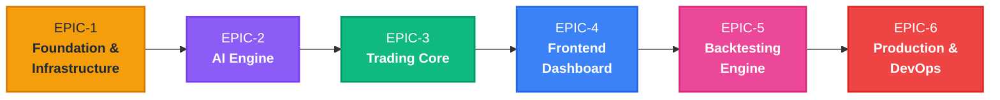
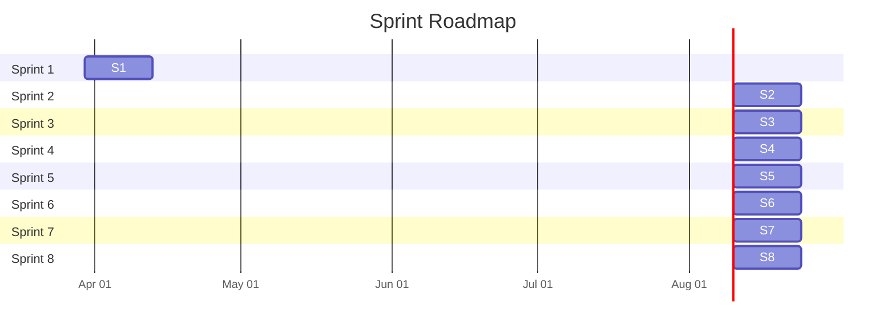
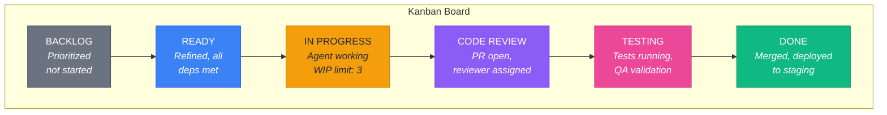
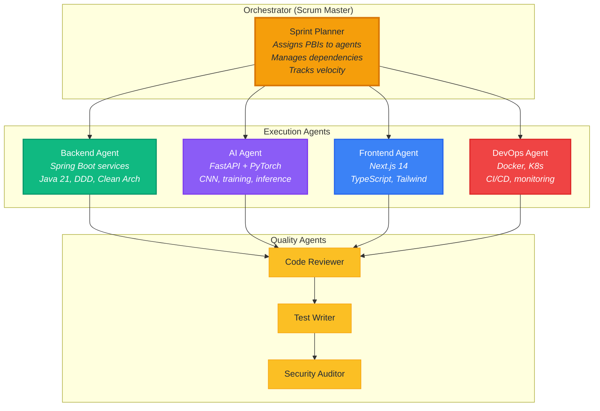
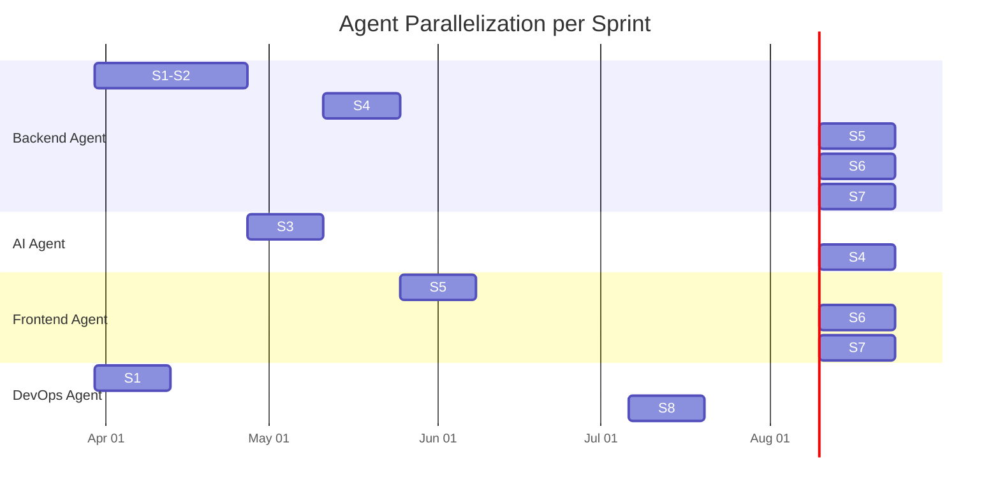
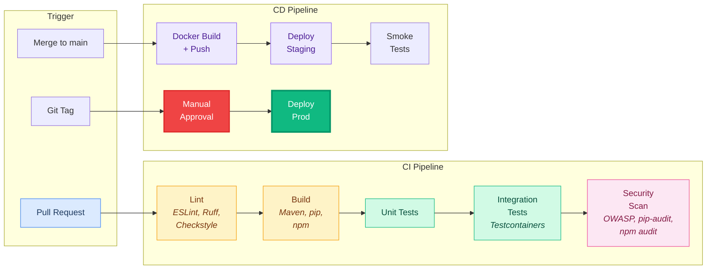
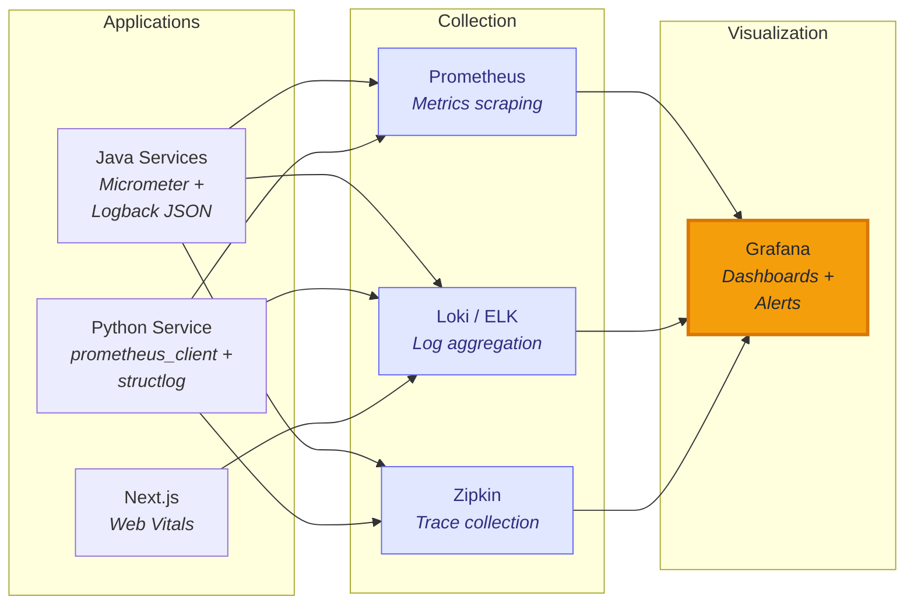

# Trading SaaS - Agile Execution Plan

> **Source of truth**: [velvet-rolling-gosling.md](.claude/plans/velvet-rolling-gosling.md)
> **Generated**: 2026-03-28 | **Methodology**: Scrum + Kanban hybrid | **Sprint length**: 2 weeks

---

## Table of Contents

1. [Epics Overview](#1-epics-overview)
2. [Features, PBIs & Tasks](#2-features-pbis--tasks)
3. [Sprint Plan](#3-sprint-plan)
4. [Kanban Board Structure](#4-kanban-board-structure)
5. [Agent Orchestration](#5-agent-orchestration)
6. [DevOps & CI/CD](#6-devops--cicd)
7. [Security & Quality](#7-security--quality)

---

## 1. Epics Overview

| Epic ID | Name | Phase | Business Value | Services | Sprints |
|---|---|---|---|---|---|
| EPIC-1 | Foundation & Infrastructure | Phase 1 | Enable all services to run locally; ingest real market data for AI training | market-data-service, infra | S1-S2 |
| EPIC-2 | AI Engine (CNN + Inference) | Phase 2 | Core AI that generates stock predictions - the product differentiator | ai-engine | S3-S4 |
| EPIC-3 | Trading Core (Auth, Signals, Strategies) | Phase 3 | User system + monetizable signal delivery - enables revenue | trading-core-service | S4-S5 |
| EPIC-4 | Frontend Dashboard | Phase 4 | User-facing product - what customers interact with | web-app | S5-S6 |
| EPIC-5 | Backtesting Engine | Phase 5 | Strategy validation - key differentiator for premium users | trading-core-service, web-app | S7 |
| EPIC-6 | Production & DevOps | Phase 6 | Scalability, security, observability - production readiness | all services, infra | S8 |

---

## 2. Features, PBIs & Tasks

---

### EPIC-1: Foundation & Infrastructure

**Description**: Set up the monorepo, Docker infrastructure, and market-data-service with Yahoo Finance ingestion, OHLCV storage, and technical indicator calculation.

**Technical scope**: Monorepo structure, docker-compose (PostgreSQL 16, Redis 7, RabbitMQ 3.13), Flyway migrations, Spring Boot 3 service with Clean Architecture, ta4j indicators, REST API, Redis caching.

---

#### FEAT-01: Monorepo & Infrastructure Setup

| ID | Title | Description | Acceptance Criteria | Priority | SP | Service |
|---|---|---|---|---|---|---|
| E1-F01-PBI-01 | Initialize monorepo structure | Create the full directory tree for all 4 services, shared specs, infrastructure, and scripts | **Given** a fresh clone **When** `ls` is run at root **Then** all directories exist per the plan: `services/`, `infrastructure/`, `shared/`, `scripts/`, `.github/` | Critical | 3 | all |
| E1-F01-PBI-02 | Create .gitignore and Makefile | Exclude build artifacts, secrets, node_modules, models; create convenience Make targets | **Given** the repo **When** `.gitignore` is checked **Then** it excludes `.env`, `target/`, `node_modules/`, `__pycache__/`, `models/`, `*.jar`, `*.pyc` | Critical | 2 | all |
| E1-F01-PBI-03 | Docker Compose for local dev | PostgreSQL 16, Redis 7, RabbitMQ 3.13 with management UI, health checks, named volumes | **Given** `docker compose up -d` **When** all containers are healthy **Then** PostgreSQL on 5432, Redis on 6379, RabbitMQ on 5672+15672 are accessible | Critical | 5 | infra |
| E1-F01-PBI-04 | Database schema initialization | SQL init script creating 3 schemas: `market_data`, `trading_core`, `ai_engine` | **Given** PostgreSQL starts **When** init script runs **Then** `\dn` shows all 3 schemas | Critical | 2 | infra |
| E1-F01-PBI-05 | Environment variable documentation | `.env.example` with all required vars for every service, documented | **Given** a developer clones the repo **When** they read `.env.example` **Then** every variable has a description and default | High | 1 | all |

**Tasks for E1-F01-PBI-01:**

| Task | File Path | Expected Output | Dependencies | DoD |
|---|---|---|---|---|
| T1: Create root project files | `README.md`, `Makefile`, `.gitignore`, `.env.example` | Files exist at repo root | None | Files committed |
| T2: Create services directories | `services/market-data-service/`, `services/trading-core-service/`, `services/ai-engine/`, `services/web-app/` | Empty scaffold with placeholder READMEs | T1 | Directories exist |
| T3: Create infra directories | `infrastructure/k8s/`, `infrastructure/init-schemas.sql` | K8s folder structure + SQL file | T1 | SQL creates 3 schemas |
| T4: Create shared and scripts dirs | `shared/api-specs/`, `scripts/setup-dev.sh`, `scripts/seed-data.sh` | Scripts are executable | T1 | `bash scripts/setup-dev.sh` runs |
| T5: Create CI workflow stubs | `.github/workflows/ci-market-data.yml`, `ci-trading-core.yml`, `ci-ai-engine.yml`, `ci-web-app.yml` | Path-triggered GitHub Actions | T1 | YAML is valid |

**Tasks for E1-F01-PBI-03:**

| Task | File Path | Expected Output | Dependencies | DoD |
|---|---|---|---|---|
| T1: Write docker-compose.yml | `docker-compose.yml` | Postgres + Redis + RabbitMQ with healthchecks | E1-F01-PBI-04 | `docker compose up` starts all 3 |
| T2: Configure PostgreSQL service | `docker-compose.yml` (postgres section) | Volume `postgres_data`, init script mount, port 5432 | None | `psql` connects |
| T3: Configure Redis service | `docker-compose.yml` (redis section) | Port 6379, healthcheck via `redis-cli ping` | None | `redis-cli ping` returns PONG |
| T4: Configure RabbitMQ service | `docker-compose.yml` (rabbitmq section) | Ports 5672+15672, default user, healthcheck | None | Management UI at localhost:15672 |
| T5: Create bridge network | `docker-compose.yml` (networks section) | `trading-saas-network` | None | Services resolve each other by name |

---

#### FEAT-02: Market Data Service - Spring Boot Scaffold

| ID | Title | Description | Acceptance Criteria | Priority | SP | Service |
|---|---|---|---|---|---|---|
| E1-F02-PBI-01 | Spring Boot project scaffold | Maven pom.xml with all dependencies, Clean Architecture package structure, application.yml | **Given** the project **When** `mvn compile` is run **Then** compilation succeeds with Java 21 | Critical | 5 | market-data-service |
| E1-F02-PBI-02 | Domain models | `Symbol`, `StockPrice`, `OHLCV`, `TechnicalIndicator`, `TimeFrame` entities and value objects | **Given** domain models **When** inspected **Then** they have zero Spring/JPA annotations | Critical | 5 | market-data-service |
| E1-F02-PBI-03 | Port interfaces | `MarketDataProvider`, `StockPriceRepository`, `MarketDataEventPublisher` in `domain/port/` | **Given** port interfaces **When** compiled **Then** they reference only domain types | Critical | 3 | market-data-service |
| E1-F02-PBI-04 | Flyway migrations | V1: symbols table, V2: stock_prices table, V3: technical_indicators table | **Given** service starts **When** Flyway runs **Then** all 3 tables exist in `market_data` schema with correct indexes | Critical | 3 | market-data-service |
| E1-F02-PBI-05 | JPA entities and mappers | JPA entities in `adapter/out/persistence/`, MapStruct mappers domain<->JPA | **Given** JPA entities **When** mapped **Then** domain models are correctly converted both ways | High | 5 | market-data-service |
| E1-F02-PBI-06 | Spring configuration | `SecurityConfig`, `RedisConfig`, `RabbitMQConfig`, application profiles (dev, prod) | **Given** service starts **When** profile=dev **Then** connects to local infra | High | 3 | market-data-service |

**Tasks for E1-F02-PBI-01:**

| Task | File Path | Expected Output | Dependencies | DoD |
|---|---|---|---|---|
| T1: Create pom.xml | `services/market-data-service/pom.xml` | Spring Boot 3.3 parent, Java 21, all deps (JPA, Flyway, AMQP, Redis, Actuator, ta4j, MapStruct) | E1-F01-PBI-01 | `mvn dependency:resolve` succeeds |
| T2: Create main application class | `src/main/java/com/tradingsaas/marketdata/MarketDataApplication.java` | `@SpringBootApplication` entry point | T1 | Compiles |
| T3: Create package structure | `domain/model/`, `domain/port/in/`, `domain/port/out/`, `domain/service/`, `application/usecase/`, `adapter/in/web/`, `adapter/out/persistence/`, `adapter/out/external/`, `adapter/out/messaging/`, `config/` | Empty packages with `package-info.java` | T1 | Package tree matches Clean Architecture |
| T4: Create application.yml | `src/main/resources/application.yml`, `application-dev.yml`, `application-prod.yml` | DB connection, Redis, RabbitMQ, server port 8081 | T1 | Service starts on port 8081 |
| T5: Create Dockerfile | `services/market-data-service/Dockerfile` | Multi-stage: eclipse-temurin:21-jdk build, eclipse-temurin:21-jre runtime, non-root user, healthcheck | T1 | `docker build` succeeds |

---

#### FEAT-03: Market Data Ingestion Pipeline

| ID | Title | Description | Acceptance Criteria | Priority | SP | Service |
|---|---|---|---|---|---|---|
| E1-F03-PBI-01 | Yahoo Finance adapter | REST client to fetch OHLCV data for configured symbols | **Given** symbol AAPL **When** adapter is called **Then** it returns 1y of daily OHLCV data | Critical | 5 | market-data-service |
| E1-F03-PBI-02 | Data ingestion use case | `FetchMarketDataUseCaseImpl` orchestrates: fetch from Yahoo, store in DB, publish event | **Given** ingestion is triggered **When** it completes **Then** OHLCV data is in PostgreSQL AND `market-data.prices.updated` event published to RabbitMQ | Critical | 5 | market-data-service |
| E1-F03-PBI-03 | Scheduled ingestion job | `@Scheduled` cron job (weekdays 6pm EST) triggers ingestion for all active symbols | **Given** cron fires **When** market is closed **Then** latest data is fetched for all active symbols | High | 3 | market-data-service |
| E1-F03-PBI-04 | RabbitMQ event publisher | Publish `market-data.prices.updated` event with symbol and date range | **Given** data is ingested **When** event is published **Then** RabbitMQ queue receives JSON message with correct routing key | High | 3 | market-data-service |

**Tasks for E1-F03-PBI-01:**

| Task | File Path | Expected Output | Dependencies | DoD |
|---|---|---|---|---|
| T1: Implement YahooFinanceAdapter | `adapter/out/external/YahooFinanceAdapter.java` | WebClient-based REST client, implements `MarketDataProvider` | E1-F02-PBI-03 | Returns OHLCV data for AAPL |
| T2: Configure WebClient bean | `config/WebClientConfig.java` | Non-blocking HTTP client with timeout (10s) | None | Bean is injectable |
| T3: Add Yahoo Finance base URL config | `application.yml` | `market-data.yahoo.base-url` property | None | Configurable per environment |
| T4: Write unit test | `test/.../YahooFinanceAdapterTest.java` | WireMock-based test with mock Yahoo response | T1 | Test passes, covers happy + error paths |

---

#### FEAT-04: Technical Indicators

| ID | Title | Description | Acceptance Criteria | Priority | SP | Service |
|---|---|---|---|---|---|---|
| E1-F04-PBI-01 | Indicator calculator service | Calculate RSI(14), MACD(12,26,9), SMA(20), SMA(50) using ta4j | **Given** 60+ days of OHLCV data **When** indicators are calculated **Then** RSI is [0,100], MACD has signal+histogram, SMA values are correct | Critical | 5 | market-data-service |
| E1-F04-PBI-02 | Indicator persistence | Store calculated indicators in `market_data.technical_indicators` table | **Given** indicators are calculated **When** saved **Then** retrievable by symbol+date+type | High | 3 | market-data-service |
| E1-F04-PBI-03 | Indicator REST API | `GET /api/v1/indicators/{ticker}?types=RSI,MACD,SMA_20,SMA_50` | **Given** indicators exist **When** GET is called **Then** returns latest indicator values with correct format | High | 3 | market-data-service |

---

#### FEAT-05: Market Data REST API

| ID | Title | Description | Acceptance Criteria | Priority | SP | Service |
|---|---|---|---|---|---|---|
| E1-F05-PBI-01 | Symbols endpoint | `GET /api/v1/symbols` - list all tracked symbols (public) | **Given** symbols in DB **When** GET is called **Then** returns paginated list of symbols with ticker, name, exchange | High | 3 | market-data-service |
| E1-F05-PBI-02 | Historical prices endpoint | `GET /api/v1/prices/{ticker}/history?from=&to=&timeframe=DAILY` | **Given** OHLCV data exists **When** GET is called **Then** returns paginated OHLCV data sorted by date DESC | High | 3 | market-data-service |
| E1-F05-PBI-03 | Redis caching for latest prices | Cache latest price per symbol in Redis (TTL 5 min) | **Given** price is fetched **When** same symbol requested within 5 min **Then** response comes from Redis (no DB hit) | Medium | 3 | market-data-service |
| E1-F05-PBI-04 | Health check and Actuator | `/actuator/health` returns service status including DB, Redis, RabbitMQ | **Given** service is running **When** health is checked **Then** returns UP with component statuses | High | 2 | market-data-service |

---

### EPIC-2: AI Engine (CNN + Inference)

**Description**: Build the Python AI service with CNN model for stock price direction prediction, feature engineering pipeline, model training/versioning, and prediction API.

**Technical scope**: FastAPI, PyTorch CNN (1D), 17-feature engineering pipeline, model registry, Alembic migrations, RabbitMQ integration, REST inference endpoint.

---

#### FEAT-06: AI Service Scaffold

| ID | Title | Description | Acceptance Criteria | Priority | SP | Service |
|---|---|---|---|---|---|---|
| E2-F06-PBI-01 | Python project setup | `pyproject.toml`, `requirements.txt`, `requirements-dev.txt`, package structure | **Given** the project **When** `pip install -e .` is run **Then** all dependencies install, package is importable | Critical | 3 | ai-engine |
| E2-F06-PBI-02 | FastAPI application entry point | `main.py` with app factory, CORS, lifespan events (model loading) | **Given** `uvicorn ai_engine.main:app` **When** started **Then** serves on port 8000 | Critical | 3 | ai-engine |
| E2-F06-PBI-03 | Configuration via pydantic-settings | `config.py` with DB URL, RabbitMQ URL, model paths, all from env vars | **Given** env vars set **When** config loaded **Then** all settings parsed and validated | Critical | 2 | ai-engine |
| E2-F06-PBI-04 | Health and readiness endpoints | `GET /health`, `GET /ready` (model loaded check) | **Given** service starts **When** model is loaded **Then** `/ready` returns 200; before load returns 503 | High | 2 | ai-engine |
| E2-F06-PBI-05 | Alembic setup + migrations | `ai_engine` schema: `model_versions`, `training_runs`, `predictions` tables | **Given** `alembic upgrade head` **When** run **Then** 3 tables created in `ai_engine` schema | Critical | 3 | ai-engine |
| E2-F06-PBI-06 | Dockerfile for AI service | Multi-stage build, Python 3.11-slim, non-root, healthcheck | **Given** `docker build` **When** completed **Then** image runs uvicorn on port 8000 | High | 2 | ai-engine |

---

#### FEAT-07: CNN Model Implementation

| ID | Title | Description | Acceptance Criteria | Priority | SP | Service |
|---|---|---|---|---|---|---|
| E2-F07-PBI-01 | Abstract BasePredictor class | Abstract interface with `preprocess()`, `predict()`, `load_model()` methods | **Given** the base class **When** inherited **Then** forces implementation of all 3 methods | Critical | 2 | ai-engine |
| E2-F07-PBI-02 | StockCNN model | 3-block 1D CNN: Conv1d(17->64->128->256), BatchNorm, MaxPool, AdaptiveAvgPool, FC head (256->128->3) | **Given** input tensor (batch, 17, 60) **When** forward pass **Then** output shape is (batch, 3) representing [DOWN, NEUTRAL, UP] logits | Critical | 8 | ai-engine |
| E2-F07-PBI-03 | Feature engineering pipeline | Calculate 17 features: OHLCV(5) + RSI, MACD, MACD_signal, MACD_hist, SMA_20, SMA_50, EMA_12, EMA_26, BB_upper, BB_lower, ATR, OBV(12) | **Given** raw OHLCV DataFrame **When** processed **Then** output has 17 columns with no NaN in valid windows | Critical | 8 | ai-engine |
| E2-F07-PBI-04 | Data normalizer | MinMaxScaler that fits on training data, transforms/inverse-transforms | **Given** raw features **When** normalized **Then** values in [0,1]; inverse transform recovers original | High | 3 | ai-engine |
| E2-F07-PBI-05 | Sequence builder | Build sliding window sequences of 60 days for CNN input | **Given** feature matrix (N_days, 17) **When** windowed **Then** output shape is (N_samples, 17, 60) | High | 3 | ai-engine |
| E2-F07-PBI-06 | Label generator | Compare close[t+5] vs close[t]: UP(>+1%), DOWN(<-1%), NEUTRAL | **Given** price series **When** labels generated **Then** 3-class labels aligned with features, no look-ahead bias | Critical | 3 | ai-engine |

**Tasks for E2-F07-PBI-02:**

| Task | File Path | Expected Output | Dependencies | DoD |
|---|---|---|---|---|
| T1: Implement StockCNN class | `src/ai_engine/core/models/cnn.py` | PyTorch `nn.Module` with 3 conv blocks + classification head | E2-F07-PBI-01 | Forward pass produces correct output shape |
| T2: Add dropout and regularization | `src/ai_engine/core/models/cnn.py` | Dropout(0.5) before FC, BatchNorm per conv block | T1 | Model trains without overfitting on small dataset |
| T3: Write model unit tests | `tests/unit/test_cnn_model.py` | Tests: output shape, gradient flow, different batch sizes, num_classes configurable | T1 | `pytest tests/unit/test_cnn_model.py` passes |
| T4: Add model to __init__ exports | `src/ai_engine/core/models/__init__.py` | `StockCNN` importable from package | T1 | `from ai_engine.core.models import StockCNN` works |

---

#### FEAT-08: Training Pipeline

| ID | Title | Description | Acceptance Criteria | Priority | SP | Service |
|---|---|---|---|---|---|---|
| E2-F08-PBI-01 | Data loader | PyTorch DataLoader with train/val/test split (70/15/15, temporal) | **Given** historical data **When** split **Then** no temporal data leakage (train < val < test) | Critical | 5 | ai-engine |
| E2-F08-PBI-02 | Trainer class | Training loop: CrossEntropyLoss (weighted), AdamW, ReduceLROnPlateau, early stopping | **Given** model + data **When** `trainer.train()` called **Then** loss decreases, metrics logged per epoch, stops early if no improvement for 10 epochs | Critical | 8 | ai-engine |
| E2-F08-PBI-03 | Evaluator class | Calculate accuracy, precision, recall, F1 per class, confusion matrix | **Given** trained model + test data **When** evaluated **Then** metrics dictionary returned with all scores | High | 3 | ai-engine |
| E2-F08-PBI-04 | Model versioning and registry | Save model artifacts + metadata, track active version, load by version | **Given** trained model **When** saved **Then** artifact on disk, metadata in DB with hyperparams + metrics | High | 5 | ai-engine |
| E2-F08-PBI-05 | Training REST endpoint | `POST /api/v1/models/train` (admin) triggers training run async | **Given** admin calls endpoint **When** training starts **Then** returns 202 with run_id, training runs in background | High | 5 | ai-engine |

---

#### FEAT-09: Prediction API & Messaging

| ID | Title | Description | Acceptance Criteria | Priority | SP | Service |
|---|---|---|---|---|---|---|
| E2-F09-PBI-01 | Single prediction endpoint | `POST /api/v1/predict` with ticker, returns direction + confidence + predicted_change | **Given** active model loaded **When** POST with valid ticker **Then** returns `{direction: "UP", confidence: 0.82, predicted_change_pct: 1.3}` | Critical | 5 | ai-engine |
| E2-F09-PBI-02 | Batch prediction endpoint | `POST /api/v1/predict/batch` with list of tickers | **Given** active model **When** batch of 10 tickers sent **Then** returns 10 predictions in < 5s | High | 3 | ai-engine |
| E2-F09-PBI-03 | RabbitMQ consumer for batch requests | Listen on `ai-engine.prediction.requests` queue, process batch predictions | **Given** message on queue **When** consumed **Then** predictions generated and published to `prediction.result.completed` | High | 5 | ai-engine |
| E2-F09-PBI-04 | RabbitMQ consumer for market data events | Listen on `ai-engine.market-data.prices` queue, trigger predictions on new data | **Given** `market-data.prices.updated` event **When** consumed **Then** predictions run for updated symbols | High | 5 | ai-engine |
| E2-F09-PBI-05 | Model management endpoints | `GET /api/v1/models`, `GET /api/v1/models/active`, `POST /api/v1/models/{id}/activate` | **Given** multiple model versions **When** admin activates one **Then** subsequent predictions use new model | Medium | 3 | ai-engine |

---

### EPIC-3: Trading Core (Auth, Signals, Strategies)

**Description**: Build the core business service: JWT authentication, subscription tiers, signal generation from AI predictions, trading strategies with risk management.

**Technical scope**: Spring Security 6, JWT (jjwt), BCrypt, Resilience4j, bucket4j rate limiting, DDD bounded contexts, RabbitMQ listeners, inter-service REST clients.

---

#### FEAT-10: Authentication System

| ID | Title | Description | Acceptance Criteria | Priority | SP | Service |
|---|---|---|---|---|---|---|
| E3-F10-PBI-01 | User domain model | `User` entity, `Subscription` entity, `SubscriptionPlan` enum (FREE/BASIC/PREMIUM) | **Given** domain models **When** inspected **Then** zero framework annotations, validation in constructors | Critical | 3 | trading-core-service |
| E3-F10-PBI-02 | Flyway migrations for users | V1: users table, V2: subscriptions table (in `trading_core` schema) | **Given** service starts **When** Flyway runs **Then** tables exist with correct constraints and indexes | Critical | 3 | trading-core-service |
| E3-F10-PBI-03 | User registration | `POST /api/v1/auth/register` with email, password, firstName, lastName | **Given** valid request **When** registered **Then** user created with BCrypt(12) hashed password, FREE subscription auto-created, returns 201 | Critical | 5 | trading-core-service |
| E3-F10-PBI-04 | JWT login | `POST /api/v1/auth/login` returns access token (15min) + refresh token (7d cookie) | **Given** valid credentials **When** login **Then** JWT contains userId, email, subscriptionPlan; refresh token in HTTP-only cookie | Critical | 8 | trading-core-service |
| E3-F10-PBI-05 | JWT authentication filter | Custom `JwtAuthenticationFilter` validates Bearer token on protected endpoints | **Given** valid JWT **When** request sent **Then** SecurityContext populated; **Given** expired JWT **Then** 401 returned | Critical | 5 | trading-core-service |
| E3-F10-PBI-06 | Token refresh | `POST /api/v1/auth/refresh` - validate refresh token, issue new access token, rotate refresh | **Given** valid refresh token **When** called **Then** new access token + new refresh token; old refresh token invalidated | High | 5 | trading-core-service |
| E3-F10-PBI-07 | Logout with Redis blacklist | `POST /api/v1/auth/logout` - add refresh token to Redis blacklist | **Given** logout called **When** old refresh token reused **Then** rejected (blacklisted) | High | 3 | trading-core-service |
| E3-F10-PBI-08 | Security configuration | `SecurityConfig.java` with endpoint protection rules matching the auth table in the API rules | **Given** unauthenticated user **When** calls `/api/v1/signals` **Then** 401; **When** calls `/api/v1/symbols` **Then** 200 | Critical | 5 | trading-core-service |

---

#### FEAT-11: Subscription & Rate Limiting

| ID | Title | Description | Acceptance Criteria | Priority | SP | Service |
|---|---|---|---|---|---|---|
| E3-F11-PBI-01 | Subscription plans endpoint | `GET /api/v1/subscriptions/plans` returns FREE/BASIC/PREMIUM details | **Given** unauthenticated user **When** GET called **Then** returns all 3 plans with features and limits | Medium | 2 | trading-core-service |
| E3-F11-PBI-02 | `@RequiresSubscription` annotation | Custom annotation + AOP aspect that checks user's plan against minimum required | **Given** FREE user **When** accesses PREMIUM endpoint **Then** 403 with message "Upgrade required" | Critical | 5 | trading-core-service |
| E3-F11-PBI-03 | Rate limiting with bucket4j + Redis | Per-user rate limits: FREE=5 signals/day, BASIC=50, PREMIUM=unlimited | **Given** FREE user **When** 6th signal request **Then** 429 with `X-RateLimit-*` headers showing remaining=0 | Critical | 5 | trading-core-service |

---

#### FEAT-12: Signal Generation Engine

| ID | Title | Description | Acceptance Criteria | Priority | SP | Service |
|---|---|---|---|---|---|---|
| E3-F12-PBI-01 | Signal domain model | `TradingSignal` entity, `SignalType` enum, `Confidence` value object, `Timeframe` enum | **Given** domain models **When** signal created **Then** validates confidence [0,1], type in BUY/SELL/HOLD | Critical | 3 | trading-core-service |
| E3-F12-PBI-02 | Flyway migration for signals | V3: `trading_signals` table with indexes on (symbol_id, generated_at DESC) | **Given** migration runs **When** inspected **Then** table in `trading_core` schema with all columns and indexes | Critical | 2 | trading-core-service |
| E3-F12-PBI-03 | AI prediction REST client | WebClient to `ai-engine POST /api/v1/predict` with Resilience4j (timeout 5s, circuit breaker) | **Given** ai-engine is up **When** prediction requested **Then** returns within 5s; **Given** ai-engine down **Then** circuit opens, fallback returns HOLD | Critical | 5 | trading-core-service |
| E3-F12-PBI-04 | Signal generation service | Orchestrates: get prediction -> apply strategy rules -> determine signal type -> calculate risk params -> store | **Given** AI returns UP with confidence 0.85 **When** signal generated **Then** BUY signal created with stop-loss and take-profit | Critical | 8 | trading-core-service |
| E3-F12-PBI-05 | RabbitMQ prediction result listener | Consume `prediction.result.completed` events, auto-generate signals | **Given** prediction event on queue **When** consumed **Then** signal generated and stored without manual trigger | High | 5 | trading-core-service |
| E3-F12-PBI-06 | Signal REST endpoints | `GET /signals` (paginated), `GET /signals/latest`, `GET /signals/{id}` | **Given** signals exist **When** GET with filters **Then** returns paginated signals matching criteria | High | 5 | trading-core-service |

---

#### FEAT-13: Strategy & Risk Management

| ID | Title | Description | Acceptance Criteria | Priority | SP | Service |
|---|---|---|---|---|---|---|
| E3-F13-PBI-01 | Strategy domain model | `Strategy` entity with `RiskParameters` (stop_loss_pct, take_profit_pct, max_position_pct) | **Given** strategy created **When** risk params set **Then** stop_loss in (0,50], take_profit in (0,100] | High | 3 | trading-core-service |
| E3-F13-PBI-02 | Strategy CRUD endpoints | `POST/GET/PUT/DELETE /api/v1/strategies` - user-owned, validated | **Given** authenticated user **When** CRUD ops **Then** strategies created/read/updated/deleted; users can only access their own | High | 5 | trading-core-service |
| E3-F13-PBI-03 | Risk manager service | Position sizing (fixed % or Kelly criterion), stop-loss/take-profit price calculation | **Given** signal BUY at $178.50, stop_loss_pct=2% **When** risk calculated **Then** stop_loss_price=$174.93, take_profit_price per strategy | High | 5 | trading-core-service |
| E3-F13-PBI-04 | Flyway migrations for strategies | V4: strategies table, V5: portfolios + positions tables | **Given** migrations run **Then** tables exist with FK constraints | High | 2 | trading-core-service |

---

### EPIC-4: Frontend Dashboard

**Description**: Build the Next.js 14 dashboard with landing page, auth flows, signals view, portfolio, and chart visualizations.

**Technical scope**: Next.js App Router, TypeScript, Tailwind CSS, shadcn/ui, TanStack Query v5, Zustand, NextAuth.js, TradingView Lightweight Charts.

---

#### FEAT-14: Frontend Scaffold & Auth

| ID | Title | Description | Acceptance Criteria | Priority | SP | Service |
|---|---|---|---|---|---|---|
| E4-F14-PBI-01 | Next.js project scaffold | `create-next-app` with App Router, TypeScript, Tailwind, ESLint | **Given** `npm run dev` **When** visited at :3000 **Then** Next.js app loads | Critical | 3 | web-app |
| E4-F14-PBI-02 | shadcn/ui setup | Install and configure shadcn/ui with project theme colors | **Given** setup complete **When** `<Button>` imported **Then** renders with project styles | Critical | 2 | web-app |
| E4-F14-PBI-03 | API client layer | Typed `api-client.ts` with auth token injection, refresh handling, error mapping | **Given** client imported **When** `apiClient.getSignals()` called **Then** request has Bearer token, retries on 401 | Critical | 5 | web-app |
| E4-F14-PBI-04 | NextAuth.js integration | Credentials provider calling `trading-core POST /auth/login`, JWT strategy | **Given** user submits login form **When** credentials valid **Then** session created, JWT stored in HTTP-only cookie | Critical | 5 | web-app |
| E4-F14-PBI-05 | Auth pages | `/auth/login` and `/auth/register` with react-hook-form + zod validation | **Given** registration form **When** submitted with valid data **Then** account created, redirected to dashboard | Critical | 5 | web-app |
| E4-F14-PBI-06 | Route protection middleware | `middleware.ts` redirects unauthenticated users from `/dashboard/*` to `/auth/login` | **Given** unauthenticated user **When** navigates to `/dashboard` **Then** redirected to login | Critical | 3 | web-app |

---

#### FEAT-15: Landing & Marketing Pages

| ID | Title | Description | Acceptance Criteria | Priority | SP | Service |
|---|---|---|---|---|---|---|
| E4-F15-PBI-01 | Landing page (SSR) | Hero section, features grid, social proof, CTA to register | **Given** visitor at `/` **When** page loads **Then** SSR rendered, < 2s LCP, responsive | High | 5 | web-app |
| E4-F15-PBI-02 | Pricing page (SSR) | FREE/BASIC/PREMIUM comparison table with feature matrix, CTA buttons | **Given** visitor at `/pricing` **When** page loads **Then** 3 tiers shown with all features from subscription table | High | 3 | web-app |

---

#### FEAT-16: Dashboard Core

| ID | Title | Description | Acceptance Criteria | Priority | SP | Service |
|---|---|---|---|---|---|---|
| E4-F16-PBI-01 | Dashboard layout | Sidebar navigation + Header with user menu, responsive (collapsible sidebar on mobile) | **Given** authenticated user **When** on dashboard **Then** sidebar shows: Overview, Signals, Portfolio, Backtest, Settings | Critical | 5 | web-app |
| E4-F16-PBI-02 | Dashboard overview page | Summary cards (total signals, portfolio value, top performer), recent signals list | **Given** user has signals **When** overview loads **Then** shows aggregated stats + last 5 signals | High | 5 | web-app |
| E4-F16-PBI-03 | Signals page | Filterable/sortable table with signal type, symbol, confidence, price, date | **Given** signals exist **When** page loads **Then** paginated table with filters; clicking a row opens detail | Critical | 8 | web-app |
| E4-F16-PBI-04 | Signal detail with chart | Candlestick chart (Lightweight Charts) with price data + signal marker overlay | **Given** user clicks signal **When** detail opens **Then** chart shows OHLCV data with signal point marked | High | 8 | web-app |
| E4-F16-PBI-05 | Portfolio page | Positions table, total P&L, allocation donut chart | **Given** user has positions **When** portfolio loads **Then** shows open positions, realized + unrealized P&L | High | 5 | web-app |
| E4-F16-PBI-06 | Settings page | Profile edit form, current subscription display, upgrade CTA | **Given** authenticated user **When** settings loaded **Then** shows email, name, current plan; can update profile | Medium | 3 | web-app |

---

#### FEAT-17: Charts & Visualization

| ID | Title | Description | Acceptance Criteria | Priority | SP | Service |
|---|---|---|---|---|---|---|
| E4-F17-PBI-01 | Candlestick chart component | Reusable `CandlestickChart.tsx` using Lightweight Charts, with indicator overlay support | **Given** OHLCV data **When** chart renders **Then** shows candlesticks with volume bars; supports SMA/EMA overlays | Critical | 8 | web-app |
| E4-F17-PBI-02 | Performance line chart | Portfolio equity curve over time | **Given** portfolio snapshots **When** rendered **Then** line chart with date x-axis, value y-axis, responsive | High | 3 | web-app |
| E4-F17-PBI-03 | Dark mode support | All components support `dark:` Tailwind variants, theme toggle in header | **Given** user toggles dark mode **When** toggled **Then** all UI switches themes; preference saved in Zustand | Medium | 3 | web-app |

---

### EPIC-5: Backtesting Engine

**Description**: Event-driven backtesting system that simulates strategies on historical data with slippage modeling and comprehensive metrics.

**Technical scope**: DataFeed/Strategy/Broker/Portfolio pattern, Sharpe/Sortino/max drawdown calculations, async execution, benchmark comparison.

---

#### FEAT-18: Backtesting Engine Core

| ID | Title | Description | Acceptance Criteria | Priority | SP | Service |
|---|---|---|---|---|---|---|
| E5-F18-PBI-01 | DataFeed component | Replays historical OHLCV data bar-by-bar from market-data-service | **Given** symbol + date range **When** DataFeed iterates **Then** yields OHLCV bars in chronological order | Critical | 5 | trading-core-service |
| E5-F18-PBI-02 | Simulated Broker | Executes orders with configurable slippage (0.1%) and commission ($0.01/share) | **Given** BUY order at $178 **When** filled with 0.1% slippage **Then** fill price = $178.178 | Critical | 5 | trading-core-service |
| E5-F18-PBI-03 | Portfolio tracker | Tracks positions, cash, equity curve per bar; calculates realized/unrealized P&L | **Given** series of fills **When** portfolio updated **Then** equity curve is continuous, P&L is accurate | Critical | 5 | trading-core-service |
| E5-F18-PBI-04 | Metrics calculator | Total return, annualized return, Sharpe, Sortino, max drawdown, Calmar, win rate, profit factor | **Given** equity curve + trade list **When** metrics calculated **Then** all values within expected ranges; Sharpe matches manual calculation | Critical | 5 | trading-core-service |
| E5-F18-PBI-05 | Benchmark comparison | Compare strategy vs S&P 500 (SPY) over same period | **Given** backtest result + SPY data **When** compared **Then** shows alpha, beta, relative performance | High | 3 | trading-core-service |
| E5-F18-PBI-06 | Async backtest execution | Submit backtest -> runs in background -> poll status -> fetch results | **Given** POST /backtests **When** submitted **Then** returns 202 with backtest_id; GET /backtests/{id} shows PENDING->RUNNING->COMPLETED | Critical | 5 | trading-core-service |
| E5-F18-PBI-07 | Backtest REST endpoints | `POST /backtests`, `GET /backtests`, `GET /backtests/{id}`, `GET /backtests/{id}/trades` | **Given** backtest completed **When** GET results **Then** returns metrics JSON + trade list | High | 3 | trading-core-service |
| E5-F18-PBI-08 | Flyway migration for backtests | V6: backtests table with results JSONB, status, user_id FK, strategy_id FK | **Given** migration runs **Then** table exists with indexes on (user_id, created_at DESC) | High | 2 | trading-core-service |

---

#### FEAT-19: Backtest Frontend

| ID | Title | Description | Acceptance Criteria | Priority | SP | Service |
|---|---|---|---|---|---|---|
| E5-F19-PBI-01 | Backtest configuration form | Symbol selector, date range picker, strategy selector, initial capital input | **Given** user fills form **When** submitted **Then** POST to /backtests with validated params | High | 5 | web-app |
| E5-F19-PBI-02 | Backtest results page | Equity curve chart, drawdown chart, metrics cards, trade list table | **Given** backtest completed **When** results page loaded **Then** all charts render, metrics accurate | High | 8 | web-app |
| E5-F19-PBI-03 | Strategy vs benchmark chart | Overlay strategy equity curve with SPY benchmark on same chart | **Given** backtest with benchmark **When** chart renders **Then** dual-line chart with legend | Medium | 3 | web-app |

---

### EPIC-6: Production & DevOps

**Description**: Production hardening: multi-stage Docker builds, Kubernetes manifests, CI/CD pipelines, observability stack, security hardening.

**Technical scope**: Docker, K8s (Deployments, HPA, NetworkPolicies), GitHub Actions, Prometheus/Grafana, Micrometer, structured logging, OWASP checks, k6 load tests.

---

#### FEAT-20: Docker & Container Optimization

| ID | Title | Description | Acceptance Criteria | Priority | SP | Service |
|---|---|---|---|---|---|---|
| E6-F20-PBI-01 | Production Docker Compose | `docker-compose.prod.yml` with resource limits, restart policies, read-only filesystems | **Given** prod compose **When** up **Then** all services run with memory/CPU limits, auto-restart | High | 3 | infra |
| E6-F20-PBI-02 | Docker image scanning | Trivy or Docker Scout scan in CI for all images | **Given** image built **When** scanned **Then** no CRITICAL/HIGH CVEs in base images or dependencies | High | 3 | infra |

---

#### FEAT-21: Kubernetes Deployment

| ID | Title | Description | Acceptance Criteria | Priority | SP | Service |
|---|---|---|---|---|---|---|
| E6-F21-PBI-01 | K8s Deployments for all services | Deployment manifests with liveness/readiness probes, resource requests/limits | **Given** manifests applied **When** pods start **Then** all 4 services running with health probes passing | Critical | 5 | infra |
| E6-F21-PBI-02 | HPA for auto-scaling | HPA for trading-core and ai-engine (CPU-based, min 2, max 10) | **Given** load increases **When** CPU > 70% **Then** pods scale up within 60s | High | 3 | infra |
| E6-F21-PBI-03 | Ingress + TLS | Ingress controller with TLS termination, path-based routing to services | **Given** HTTPS request **When** routed **Then** reaches correct service based on path | High | 3 | infra |
| E6-F21-PBI-04 | NetworkPolicies | Restrict pod-to-pod traffic: web-app cannot reach ai-engine directly | **Given** network policies applied **When** web-app tries to call ai-engine **Then** connection refused | Medium | 3 | infra |
| E6-F21-PBI-05 | ConfigMaps and Secrets | K8s ConfigMaps for app config, Secrets for credentials | **Given** secrets created **When** pods start **Then** env vars injected from K8s secrets, not hardcoded | Critical | 3 | infra |

---

#### FEAT-22: CI/CD Pipelines

| ID | Title | Description | Acceptance Criteria | Priority | SP | Service |
|---|---|---|---|---|---|---|
| E6-F22-PBI-01 | GitHub Actions per service | Path-triggered workflows: build -> test -> Docker -> push | **Given** PR changes `services/ai-engine/` **When** CI runs **Then** only ai-engine pipeline triggers | Critical | 5 | infra |
| E6-F22-PBI-02 | Staging deploy pipeline | Auto-deploy to staging on merge to main | **Given** PR merged to main **When** CI passes **Then** staging environment updated within 10 min | High | 5 | infra |
| E6-F22-PBI-03 | Production deploy pipeline | Manual approval gate, rolling update, smoke tests | **Given** staging verified **When** manual approval **Then** prod rolling update with zero downtime | High | 5 | infra |

---

#### FEAT-23: Observability

| ID | Title | Description | Acceptance Criteria | Priority | SP | Service |
|---|---|---|---|---|---|---|
| E6-F23-PBI-01 | Structured JSON logging | Logback (Java) + structlog (Python) with correlation IDs | **Given** request flows through services **When** logs collected **Then** searchable by correlation_id across services | High | 3 | all |
| E6-F23-PBI-02 | Prometheus metrics | Micrometer (Java) + prometheus_client (Python) exposing /metrics | **Given** services running **When** Prometheus scrapes **Then** HTTP request latency, error rates, JVM/Python metrics visible | High | 5 | all |
| E6-F23-PBI-03 | Grafana dashboards | Pre-built dashboards: service health, API latency, signal generation rate, model accuracy | **Given** Grafana configured **When** dashboard opened **Then** shows real-time metrics per service | Medium | 5 | infra |
| E6-F23-PBI-04 | Distributed tracing | Micrometer Tracing (Java) + OpenTelemetry (Python) with Zipkin/Jaeger | **Given** request spans services **When** trace viewed **Then** full call chain visible with timing | Medium | 5 | all |

---

#### FEAT-24: Security Hardening

| ID | Title | Description | Acceptance Criteria | Priority | SP | Service |
|---|---|---|---|---|---|---|
| E6-F24-PBI-01 | OWASP dependency check in CI | `mvn dependency-check:check`, `pip-audit`, `npm audit` in every pipeline | **Given** CI runs **When** vulnerable dep found **Then** build fails with CVE report | Critical | 3 | all |
| E6-F24-PBI-02 | Security headers | CSP, X-Frame-Options, X-Content-Type-Options, HSTS on all responses | **Given** any HTTP response **When** headers inspected **Then** all security headers present | High | 2 | all |
| E6-F24-PBI-03 | CORS configuration | Whitelist specific origins per environment (no `*` in prod) | **Given** cross-origin request **When** origin not whitelisted **Then** CORS error; **When** whitelisted **Then** allowed | High | 2 | all |
| E6-F24-PBI-04 | Load testing with k6 | k6 scripts: login flow, fetch signals, run backtest (100 concurrent users) | **Given** k6 script **When** executed **Then** p95 latency < 500ms for signals, < 2s for backtest submit | Medium | 5 | all |

---

## 3. Sprint Plan

### Sprint 1 (Mar 30 - Apr 12): Foundation
**Goal**: Monorepo running with all infrastructure + market-data-service compiling

| PBI | SP | Agent |
|---|---|---|
| E1-F01-PBI-01: Initialize monorepo structure | 3 | Backend |
| E1-F01-PBI-02: .gitignore and Makefile | 2 | Backend |
| E1-F01-PBI-03: Docker Compose for local dev | 5 | DevOps |
| E1-F01-PBI-04: Database schema initialization | 2 | DevOps |
| E1-F01-PBI-05: Environment variable docs | 1 | Backend |
| E1-F02-PBI-01: Spring Boot project scaffold | 5 | Backend |
| E1-F02-PBI-02: Domain models | 5 | Backend |
| E1-F02-PBI-03: Port interfaces | 3 | Backend |
| E1-F02-PBI-04: Flyway migrations | 3 | Backend |
| **Total** | **29** | |

**Deliverable**: `docker compose up` starts infra + market-data-service with empty endpoints
**Verification**: `curl http://localhost:8081/actuator/health` returns UP

---

### Sprint 2 (Apr 13 - Apr 26): Data Ingestion
**Goal**: Yahoo Finance data flowing into PostgreSQL, technical indicators calculated, REST API serving data

| PBI | SP | Agent |
|---|---|---|
| E1-F02-PBI-05: JPA entities and mappers | 5 | Backend |
| E1-F02-PBI-06: Spring configuration | 3 | Backend |
| E1-F03-PBI-01: Yahoo Finance adapter | 5 | Backend |
| E1-F03-PBI-02: Data ingestion use case | 5 | Backend |
| E1-F03-PBI-03: Scheduled ingestion job | 3 | Backend |
| E1-F03-PBI-04: RabbitMQ event publisher | 3 | Backend |
| E1-F04-PBI-01: Indicator calculator service | 5 | Backend |
| E1-F04-PBI-02: Indicator persistence | 3 | Backend |
| E1-F04-PBI-03: Indicator REST API | 3 | Backend |
| E1-F05-PBI-01: Symbols endpoint | 3 | Backend |
| E1-F05-PBI-02: Historical prices endpoint | 3 | Backend |
| E1-F05-PBI-03: Redis caching | 3 | Backend |
| E1-F05-PBI-04: Health check + Actuator | 2 | Backend |
| **Total** | **46** | |

**Deliverable**: `GET /api/v1/prices/AAPL/history` returns real OHLCV data
**Verification**: Data in PostgreSQL, indicators calculated, Redis caching working

---

### Sprint 3 (Apr 27 - May 10): AI Foundation
**Goal**: CNN model implemented, feature engineering pipeline tested, training pipeline functional

| PBI | SP | Agent |
|---|---|---|
| E2-F06-PBI-01: Python project setup | 3 | AI |
| E2-F06-PBI-02: FastAPI entry point | 3 | AI |
| E2-F06-PBI-03: Configuration | 2 | AI |
| E2-F06-PBI-04: Health endpoints | 2 | AI |
| E2-F06-PBI-05: Alembic migrations | 3 | AI |
| E2-F06-PBI-06: Dockerfile | 2 | AI |
| E2-F07-PBI-01: BasePredictor class | 2 | AI |
| E2-F07-PBI-02: StockCNN model | 8 | AI |
| E2-F07-PBI-03: Feature engineering | 8 | AI |
| E2-F07-PBI-04: Data normalizer | 3 | AI |
| E2-F07-PBI-05: Sequence builder | 3 | AI |
| E2-F07-PBI-06: Label generator | 3 | AI |
| **Total** | **42** | |

**Deliverable**: CNN model passes unit tests, feature pipeline produces correct shapes
**Verification**: `pytest tests/unit/` all passing

---

### Sprint 4 (May 11 - May 24): AI API + Auth Start
**Goal**: AI prediction API live, training pipeline functional; auth system started

| PBI | SP | Agent |
|---|---|---|
| E2-F08-PBI-01: Data loader | 5 | AI |
| E2-F08-PBI-02: Trainer class | 8 | AI |
| E2-F08-PBI-03: Evaluator class | 3 | AI |
| E2-F08-PBI-04: Model registry | 5 | AI |
| E2-F08-PBI-05: Training endpoint | 5 | AI |
| E2-F09-PBI-01: Single prediction | 5 | AI |
| E2-F09-PBI-02: Batch prediction | 3 | AI |
| E2-F09-PBI-03: RabbitMQ consumer (batch) | 5 | AI |
| E2-F09-PBI-04: RabbitMQ consumer (market data) | 5 | AI |
| E2-F09-PBI-05: Model management endpoints | 3 | AI |
| E3-F10-PBI-01: User domain model | 3 | Backend |
| E3-F10-PBI-02: Flyway migrations (users) | 3 | Backend |
| **Total** | **53** | |

**Deliverable**: `POST /api/v1/predict` returns live predictions; user tables in DB
**Verification**: End-to-end: market data -> RabbitMQ -> AI inference -> prediction result

---

### Sprint 5 (May 25 - Jun 7): Core Backend + Frontend Start
**Goal**: Full auth system, signal generation working, frontend scaffold with auth

| PBI | SP | Agent |
|---|---|---|
| E3-F10-PBI-03: User registration | 5 | Backend |
| E3-F10-PBI-04: JWT login | 8 | Backend |
| E3-F10-PBI-05: JWT auth filter | 5 | Backend |
| E3-F10-PBI-06: Token refresh | 5 | Backend |
| E3-F10-PBI-07: Logout + Redis blacklist | 3 | Backend |
| E3-F10-PBI-08: Security configuration | 5 | Backend |
| E3-F11-PBI-01: Subscription plans endpoint | 2 | Backend |
| E3-F11-PBI-02: @RequiresSubscription | 5 | Backend |
| E3-F11-PBI-03: Rate limiting | 5 | Backend |
| E4-F14-PBI-01: Next.js scaffold | 3 | Frontend |
| E4-F14-PBI-02: shadcn/ui setup | 2 | Frontend |
| E4-F14-PBI-03: API client layer | 5 | Frontend |
| **Total** | **53** | |

**Deliverable**: Register -> Login -> JWT -> Authenticated API calls working; Next.js app running
**Verification**: Full auth flow via Postman; `npm run dev` serves at :3000

---

### Sprint 6 (Jun 8 - Jun 21): Signals + Dashboard
**Goal**: Signal generation pipeline complete, dashboard showing real signals with charts

| PBI | SP | Agent |
|---|---|---|
| E3-F12-PBI-01: Signal domain model | 3 | Backend |
| E3-F12-PBI-02: Flyway migration (signals) | 2 | Backend |
| E3-F12-PBI-03: AI prediction REST client | 5 | Backend |
| E3-F12-PBI-04: Signal generation service | 8 | Backend |
| E3-F12-PBI-05: RabbitMQ prediction listener | 5 | Backend |
| E3-F12-PBI-06: Signal REST endpoints | 5 | Backend |
| E3-F13-PBI-01: Strategy domain model | 3 | Backend |
| E3-F13-PBI-02: Strategy CRUD | 5 | Backend |
| E3-F13-PBI-03: Risk manager | 5 | Backend |
| E3-F13-PBI-04: Flyway (strategies) | 2 | Backend |
| E4-F14-PBI-04: NextAuth.js integration | 5 | Frontend |
| E4-F14-PBI-05: Auth pages | 5 | Frontend |
| E4-F14-PBI-06: Route protection | 3 | Frontend |
| E4-F15-PBI-01: Landing page | 5 | Frontend |
| E4-F15-PBI-02: Pricing page | 3 | Frontend |
| E4-F16-PBI-01: Dashboard layout | 5 | Frontend |
| E4-F16-PBI-02: Dashboard overview | 5 | Frontend |
| E4-F16-PBI-03: Signals page | 8 | Frontend |
| **Total** | **82** | |

**Note**: Sprint 6 is overloaded (82 SP). Backend and Frontend agents run in **full parallel** here - Backend handles FEAT-12/13 while Frontend handles FEAT-14/15/16. Actual per-agent velocity: Backend ~43 SP, Frontend ~39 SP.

**Deliverable**: Users see real AI-generated trading signals on the dashboard
**Verification**: Login at :3000 -> Navigate to Signals -> See BUY/SELL/HOLD signals with data

---

### Sprint 7 (Jun 22 - Jul 5): Backtesting + Charts
**Goal**: Backtesting engine running, all charts working, portfolio view complete

| PBI | SP | Agent |
|---|---|---|
| E4-F16-PBI-04: Signal detail + chart | 8 | Frontend |
| E4-F16-PBI-05: Portfolio page | 5 | Frontend |
| E4-F16-PBI-06: Settings page | 3 | Frontend |
| E4-F17-PBI-01: Candlestick chart | 8 | Frontend |
| E4-F17-PBI-02: Performance chart | 3 | Frontend |
| E4-F17-PBI-03: Dark mode | 3 | Frontend |
| E5-F18-PBI-01: DataFeed | 5 | Backend |
| E5-F18-PBI-02: Simulated Broker | 5 | Backend |
| E5-F18-PBI-03: Portfolio tracker | 5 | Backend |
| E5-F18-PBI-04: Metrics calculator | 5 | Backend |
| E5-F18-PBI-05: Benchmark comparison | 3 | Backend |
| E5-F18-PBI-06: Async execution | 5 | Backend |
| E5-F18-PBI-07: Backtest REST endpoints | 3 | Backend |
| E5-F18-PBI-08: Flyway migration | 2 | Backend |
| E5-F19-PBI-01: Backtest config form | 5 | Frontend |
| E5-F19-PBI-02: Backtest results page | 8 | Frontend |
| E5-F19-PBI-03: Benchmark chart | 3 | Frontend |
| **Total** | **79** | |

**Deliverable**: User can configure + run a backtest and see equity curve + metrics
**Verification**: Create strategy -> Run backtest -> View results with Sharpe ratio and equity chart

---

### Sprint 8 (Jul 6 - Jul 19): Production Hardening
**Goal**: Production-ready with CI/CD, monitoring, security, load-tested

| PBI | SP | Agent |
|---|---|---|
| E6-F20-PBI-01: Production Docker Compose | 3 | DevOps |
| E6-F20-PBI-02: Docker image scanning | 3 | DevOps |
| E6-F21-PBI-01: K8s Deployments | 5 | DevOps |
| E6-F21-PBI-02: HPA auto-scaling | 3 | DevOps |
| E6-F21-PBI-03: Ingress + TLS | 3 | DevOps |
| E6-F21-PBI-04: NetworkPolicies | 3 | DevOps |
| E6-F21-PBI-05: ConfigMaps + Secrets | 3 | DevOps |
| E6-F22-PBI-01: GitHub Actions per service | 5 | DevOps |
| E6-F22-PBI-02: Staging deploy | 5 | DevOps |
| E6-F22-PBI-03: Production deploy | 5 | DevOps |
| E6-F23-PBI-01: Structured logging | 3 | DevOps |
| E6-F23-PBI-02: Prometheus metrics | 5 | DevOps |
| E6-F23-PBI-03: Grafana dashboards | 5 | DevOps |
| E6-F23-PBI-04: Distributed tracing | 5 | DevOps |
| E6-F24-PBI-01: OWASP dependency check | 3 | DevOps |
| E6-F24-PBI-02: Security headers | 2 | DevOps |
| E6-F24-PBI-03: CORS configuration | 2 | DevOps |
| E6-F24-PBI-04: Load testing k6 | 5 | DevOps |
| **Total** | **68** | |

**Deliverable**: All services deployed to staging/prod with monitoring and CI/CD
**Verification**: `kubectl get pods` shows all healthy; Grafana dashboard shows metrics; k6 report clean

---

## 4. Kanban Board Structure

### Column Rules

| Column | Entry Criteria | Exit Criteria | WIP Limit |
|---|---|---|---|
| **Backlog** | PBI created with AC and story points | Refined, dependencies identified | None |
| **Ready** | All blocking dependencies resolved, tasks broken down | Agent assigned, work started | 10 |
| **In Progress** | Agent actively working on tasks | All tasks complete, PR created | 3 per agent |
| **Code Review** | PR opened with all checks passing | Approved by code-reviewer agent, no blocking issues | 5 |
| **Testing** | Tests written, CI green | All tests pass, integration verified | 5 |
| **Done** | Merged to main, deployed to staging | Verified in staging environment | None |

### Initial Board State (Sprint 1)

| Backlog | Ready | In Progress | Code Review | Testing | Done |
|---|---|---|---|---|---|
| E1-F02-PBI-05 | E1-F01-PBI-01 | | | | |
| E1-F02-PBI-06 | E1-F01-PBI-02 | | | | |
| E1-F03-* | E1-F01-PBI-03 | | | | |
| E1-F04-* | E1-F01-PBI-04 | | | | |
| E1-F05-* | E1-F01-PBI-05 | | | | |
| EPIC-2 all | E1-F02-PBI-01 | | | | |
| EPIC-3 all | E1-F02-PBI-02 | | | | |
| EPIC-4 all | E1-F02-PBI-03 | | | | |
| EPIC-5 all | E1-F02-PBI-04 | | | | |
| EPIC-6 all | | | | | |

---

## 5. Agent Orchestration

### Agent Capabilities

| Agent | Services | Tools | Skills |
|---|---|---|---|
| **Backend Agent** | market-data-service, trading-core-service | Java 21, Maven, Spring Boot, JPA, Flyway, MapStruct | Clean Architecture, DDD, SOLID, Resilience4j |
| **AI Agent** | ai-engine | Python 3.11, PyTorch, FastAPI, Alembic, pandas | CNN architecture, feature engineering, model training |
| **Frontend Agent** | web-app | TypeScript, Next.js 14, Tailwind, shadcn/ui | App Router, TanStack Query, TradingView Charts |
| **DevOps Agent** | infrastructure | Docker, K8s, GitHub Actions, Prometheus, Grafana | CI/CD, monitoring, security scanning, load testing |

### Parallelization Strategy

### Blocking Dependencies

| Dependency | Blocks | Unblocked When |
|---|---|---|
| Docker infra (S1) | All services | PostgreSQL + Redis + RabbitMQ running |
| market-data-service API (S2) | ai-engine data consumption | `GET /api/v1/prices/{ticker}/history` returning data |
| AI prediction API (S4) | Signal generation in trading-core | `POST /api/v1/predict` returning predictions |
| Auth system (S5) | Frontend auth integration | JWT login/register endpoints working |
| trading-core signal API (S6) | Frontend signals page | `GET /api/v1/signals` returning data |
| Backtest engine (S7) | Backtest UI | `POST /backtests` + `GET /backtests/{id}` working |

---

## 6. DevOps & CI/CD

### Pipeline Architecture

### Environments

| Environment | Trigger | Infrastructure | Data |
|---|---|---|---|
| **Local (dev)** | `docker compose up` | Docker Compose, local volumes | Seeded sample data |
| **CI** | PR opened/updated | Testcontainers (ephemeral) | Test fixtures |
| **Staging** | Merge to main | K8s staging namespace | Subset of production data |
| **Production** | Manual approval on git tag | K8s production namespace | Live market data |

---

## 7. Security & Quality

### Testing Strategy (per service)

| Layer | Type | Tools | Coverage Target |
|---|---|---|---|
| Domain | Unit | JUnit 5 / pytest | 90%+ |
| Application | Unit | JUnit 5 + Mockito / pytest | 85%+ |
| Controllers | Slice | @WebMvcTest / httpx.AsyncClient | 80%+ |
| Repository | Slice | @DataJpaTest + Testcontainers | All custom queries |
| Integration | E2E | @SpringBootTest / pytest + Testcontainers | Critical paths |
| Frontend | Unit | Jest + RTL | All components |
| Frontend | E2E | Playwright | Login, signals, backtest |

### OWASP Compliance Matrix

| OWASP | Control | Implementation | PBI |
|---|---|---|---|
| A01 Broken Access Control | JWT + RBAC + ownership check | Spring Security + custom filters | E3-F10-PBI-05/08 |
| A02 Crypto Failures | BCrypt(12), JWT HS256 256-bit key | jjwt, Spring Security | E3-F10-PBI-03/04 |
| A03 Injection | Parameterized queries only | JPA, SQLAlchemy | All DB PBIs |
| A04 Insecure Design | Rate limiting, resource limits | bucket4j, K8s limits | E3-F11-PBI-03 |
| A05 Misconfiguration | Actuator restricted, CORS whitelist | SecurityConfig | E6-F24-PBI-02/03 |
| A06 Vulnerable Components | CI dependency scanning | OWASP dep check, pip-audit, npm audit | E6-F24-PBI-01 |
| A07 Auth Failures | Token expiry, rotation, blacklist | Redis + JWT | E3-F10-PBI-06/07 |
| A08 Data Integrity | Immutable migrations, signed images | Flyway checksums, Docker signing | E6-F20-PBI-02 |
| A09 Logging Failures | Structured logging, no PII in logs | Logback JSON, structlog | E6-F23-PBI-01 |
| A10 SSRF | URL allowlisting for external calls | WebClient config, httpx config | E3-F12-PBI-03 |

### Observability Stack

---

## Appendix: PBI Quick Reference

| ID | Title | Epic | Sprint | SP | Agent |
|---|---|---|---|---|---|
| E1-F01-PBI-01 | Initialize monorepo | EPIC-1 | S1 | 3 | Backend |
| E1-F01-PBI-02 | .gitignore + Makefile | EPIC-1 | S1 | 2 | Backend |
| E1-F01-PBI-03 | Docker Compose | EPIC-1 | S1 | 5 | DevOps |
| E1-F01-PBI-04 | Schema initialization | EPIC-1 | S1 | 2 | DevOps |
| E1-F01-PBI-05 | Env var docs | EPIC-1 | S1 | 1 | Backend |
| E1-F02-PBI-01 | Spring Boot scaffold | EPIC-1 | S1 | 5 | Backend |
| E1-F02-PBI-02 | Domain models | EPIC-1 | S1 | 5 | Backend |
| E1-F02-PBI-03 | Port interfaces | EPIC-1 | S1 | 3 | Backend |
| E1-F02-PBI-04 | Flyway migrations | EPIC-1 | S1 | 3 | Backend |
| E1-F02-PBI-05 | JPA entities/mappers | EPIC-1 | S2 | 5 | Backend |
| E1-F02-PBI-06 | Spring config | EPIC-1 | S2 | 3 | Backend |
| E1-F03-PBI-01 | Yahoo Finance adapter | EPIC-1 | S2 | 5 | Backend |
| E1-F03-PBI-02 | Ingestion use case | EPIC-1 | S2 | 5 | Backend |
| E1-F03-PBI-03 | Scheduled job | EPIC-1 | S2 | 3 | Backend |
| E1-F03-PBI-04 | RabbitMQ publisher | EPIC-1 | S2 | 3 | Backend |
| E1-F04-PBI-01 | Indicator calculator | EPIC-1 | S2 | 5 | Backend |
| E1-F04-PBI-02 | Indicator persistence | EPIC-1 | S2 | 3 | Backend |
| E1-F04-PBI-03 | Indicator API | EPIC-1 | S2 | 3 | Backend |
| E1-F05-PBI-01 | Symbols endpoint | EPIC-1 | S2 | 3 | Backend |
| E1-F05-PBI-02 | Historical prices | EPIC-1 | S2 | 3 | Backend |
| E1-F05-PBI-03 | Redis caching | EPIC-1 | S2 | 3 | Backend |
| E1-F05-PBI-04 | Health + Actuator | EPIC-1 | S2 | 2 | Backend |
| E2-F06-PBI-01 | Python project setup | EPIC-2 | S3 | 3 | AI |
| E2-F06-PBI-02 | FastAPI entry | EPIC-2 | S3 | 3 | AI |
| E2-F06-PBI-03 | Configuration | EPIC-2 | S3 | 2 | AI |
| E2-F06-PBI-04 | Health endpoints | EPIC-2 | S3 | 2 | AI |
| E2-F06-PBI-05 | Alembic migrations | EPIC-2 | S3 | 3 | AI |
| E2-F06-PBI-06 | Dockerfile | EPIC-2 | S3 | 2 | AI |
| E2-F07-PBI-01 | BasePredictor | EPIC-2 | S3 | 2 | AI |
| E2-F07-PBI-02 | StockCNN model | EPIC-2 | S3 | 8 | AI |
| E2-F07-PBI-03 | Feature engineering | EPIC-2 | S3 | 8 | AI |
| E2-F07-PBI-04 | Normalizer | EPIC-2 | S3 | 3 | AI |
| E2-F07-PBI-05 | Sequence builder | EPIC-2 | S3 | 3 | AI |
| E2-F07-PBI-06 | Label generator | EPIC-2 | S3 | 3 | AI |
| E2-F08-PBI-01 | Data loader | EPIC-2 | S4 | 5 | AI |
| E2-F08-PBI-02 | Trainer class | EPIC-2 | S4 | 8 | AI |
| E2-F08-PBI-03 | Evaluator | EPIC-2 | S4 | 3 | AI |
| E2-F08-PBI-04 | Model registry | EPIC-2 | S4 | 5 | AI |
| E2-F08-PBI-05 | Training endpoint | EPIC-2 | S4 | 5 | AI |
| E2-F09-PBI-01 | Single prediction | EPIC-2 | S4 | 5 | AI |
| E2-F09-PBI-02 | Batch prediction | EPIC-2 | S4 | 3 | AI |
| E2-F09-PBI-03 | RabbitMQ batch consumer | EPIC-2 | S4 | 5 | AI |
| E2-F09-PBI-04 | RabbitMQ market data consumer | EPIC-2 | S4 | 5 | AI |
| E2-F09-PBI-05 | Model management API | EPIC-2 | S4 | 3 | AI |
| E3-F10-PBI-01 | User domain model | EPIC-3 | S4 | 3 | Backend |
| E3-F10-PBI-02 | User migrations | EPIC-3 | S4 | 3 | Backend |
| E3-F10-PBI-03 | Registration | EPIC-3 | S5 | 5 | Backend |
| E3-F10-PBI-04 | JWT login | EPIC-3 | S5 | 8 | Backend |
| E3-F10-PBI-05 | JWT filter | EPIC-3 | S5 | 5 | Backend |
| E3-F10-PBI-06 | Token refresh | EPIC-3 | S5 | 5 | Backend |
| E3-F10-PBI-07 | Logout blacklist | EPIC-3 | S5 | 3 | Backend |
| E3-F10-PBI-08 | Security config | EPIC-3 | S5 | 5 | Backend |
| E3-F11-PBI-01 | Subscription plans | EPIC-3 | S5 | 2 | Backend |
| E3-F11-PBI-02 | @RequiresSubscription | EPIC-3 | S5 | 5 | Backend |
| E3-F11-PBI-03 | Rate limiting | EPIC-3 | S5 | 5 | Backend |
| E3-F12-PBI-01 | Signal domain | EPIC-3 | S6 | 3 | Backend |
| E3-F12-PBI-02 | Signal migration | EPIC-3 | S6 | 2 | Backend |
| E3-F12-PBI-03 | AI REST client | EPIC-3 | S6 | 5 | Backend |
| E3-F12-PBI-04 | Signal generation | EPIC-3 | S6 | 8 | Backend |
| E3-F12-PBI-05 | Prediction listener | EPIC-3 | S6 | 5 | Backend |
| E3-F12-PBI-06 | Signal endpoints | EPIC-3 | S6 | 5 | Backend |
| E3-F13-PBI-01 | Strategy model | EPIC-3 | S6 | 3 | Backend |
| E3-F13-PBI-02 | Strategy CRUD | EPIC-3 | S6 | 5 | Backend |
| E3-F13-PBI-03 | Risk manager | EPIC-3 | S6 | 5 | Backend |
| E3-F13-PBI-04 | Strategy migration | EPIC-3 | S6 | 2 | Backend |
| E4-F14-PBI-01 | Next.js scaffold | EPIC-4 | S5 | 3 | Frontend |
| E4-F14-PBI-02 | shadcn/ui setup | EPIC-4 | S5 | 2 | Frontend |
| E4-F14-PBI-03 | API client | EPIC-4 | S5 | 5 | Frontend |
| E4-F14-PBI-04 | NextAuth.js | EPIC-4 | S6 | 5 | Frontend |
| E4-F14-PBI-05 | Auth pages | EPIC-4 | S6 | 5 | Frontend |
| E4-F14-PBI-06 | Route protection | EPIC-4 | S6 | 3 | Frontend |
| E4-F15-PBI-01 | Landing page | EPIC-4 | S6 | 5 | Frontend |
| E4-F15-PBI-02 | Pricing page | EPIC-4 | S6 | 3 | Frontend |
| E4-F16-PBI-01 | Dashboard layout | EPIC-4 | S6 | 5 | Frontend |
| E4-F16-PBI-02 | Overview page | EPIC-4 | S6 | 5 | Frontend |
| E4-F16-PBI-03 | Signals page | EPIC-4 | S6 | 8 | Frontend |
| E4-F16-PBI-04 | Signal detail + chart | EPIC-4 | S7 | 8 | Frontend |
| E4-F16-PBI-05 | Portfolio page | EPIC-4 | S7 | 5 | Frontend |
| E4-F16-PBI-06 | Settings page | EPIC-4 | S7 | 3 | Frontend |
| E4-F17-PBI-01 | Candlestick chart | EPIC-4 | S7 | 8 | Frontend |
| E4-F17-PBI-02 | Performance chart | EPIC-4 | S7 | 3 | Frontend |
| E4-F17-PBI-03 | Dark mode | EPIC-4 | S7 | 3 | Frontend |
| E5-F18-PBI-01 | DataFeed | EPIC-5 | S7 | 5 | Backend |
| E5-F18-PBI-02 | Simulated Broker | EPIC-5 | S7 | 5 | Backend |
| E5-F18-PBI-03 | Portfolio tracker | EPIC-5 | S7 | 5 | Backend |
| E5-F18-PBI-04 | Metrics calculator | EPIC-5 | S7 | 5 | Backend |
| E5-F18-PBI-05 | Benchmark comparison | EPIC-5 | S7 | 3 | Backend |
| E5-F18-PBI-06 | Async execution | EPIC-5 | S7 | 5 | Backend |
| E5-F18-PBI-07 | Backtest endpoints | EPIC-5 | S7 | 3 | Backend |
| E5-F18-PBI-08 | Backtest migration | EPIC-5 | S7 | 2 | Backend |
| E5-F19-PBI-01 | Backtest form | EPIC-5 | S7 | 5 | Frontend |
| E5-F19-PBI-02 | Results page | EPIC-5 | S7 | 8 | Frontend |
| E5-F19-PBI-03 | Benchmark chart | EPIC-5 | S7 | 3 | Frontend |
| E6-F20-PBI-01 | Prod Docker Compose | EPIC-6 | S8 | 3 | DevOps |
| E6-F20-PBI-02 | Image scanning | EPIC-6 | S8 | 3 | DevOps |
| E6-F21-PBI-01 | K8s Deployments | EPIC-6 | S8 | 5 | DevOps |
| E6-F21-PBI-02 | HPA | EPIC-6 | S8 | 3 | DevOps |
| E6-F21-PBI-03 | Ingress + TLS | EPIC-6 | S8 | 3 | DevOps |
| E6-F21-PBI-04 | NetworkPolicies | EPIC-6 | S8 | 3 | DevOps |
| E6-F21-PBI-05 | ConfigMaps + Secrets | EPIC-6 | S8 | 3 | DevOps |
| E6-F22-PBI-01 | GitHub Actions | EPIC-6 | S8 | 5 | DevOps |
| E6-F22-PBI-02 | Staging deploy | EPIC-6 | S8 | 5 | DevOps |
| E6-F22-PBI-03 | Prod deploy | EPIC-6 | S8 | 5 | DevOps |
| E6-F23-PBI-01 | Structured logging | EPIC-6 | S8 | 3 | DevOps |
| E6-F23-PBI-02 | Prometheus metrics | EPIC-6 | S8 | 5 | DevOps |
| E6-F23-PBI-03 | Grafana dashboards | EPIC-6 | S8 | 5 | DevOps |
| E6-F23-PBI-04 | Distributed tracing | EPIC-6 | S8 | 5 | DevOps |
| E6-F24-PBI-01 | OWASP dep check | EPIC-6 | S8 | 3 | DevOps |
| E6-F24-PBI-02 | Security headers | EPIC-6 | S8 | 2 | DevOps |
| E6-F24-PBI-03 | CORS config | EPIC-6 | S8 | 2 | DevOps |
| E6-F24-PBI-04 | Load testing k6 | EPIC-6 | S8 | 5 | DevOps |

**Total: 6 Epics | 24 Features | 97 PBIs | ~450 Story Points | 8 Sprints**
