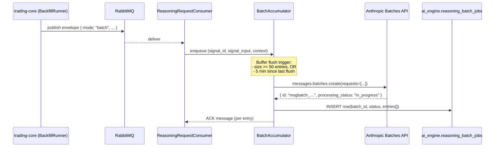

# Tier C.2-b — Reasoning Batch API Design

Status: design only. No implementation yet — this branch ships C2-a (cache marker)
and this document; the wiring will land in follow-up branches once the design is
validated.

## Goal

Cut Anthropic spend on reasoning generation by routing the **backfill** path
through the Anthropic Message Batches API (50 % off per call). Fresh
cron-generated signals keep the synchronous path so the dashboard's "AI
rationale" stays available within seconds of a new signal.

## Non-goals

- Replacing the synchronous path entirely. Users see fresh signals; latency
  matters there.
- Cross-batch validator retries. A `REFUSED_BY_VALIDATOR` outcome inside a
  batch is recorded as such and surfaces in the audit explorer; no
  in-batch resubmit (would double the SLA on the affected row).
- Real-time batch progress UI. Operators read job state from the DB or a
  Grafana panel; no per-batch endpoint.

## Decision: which path is "batch"

| Producer                                 | Path  | Why                                                                 |
| ---------------------------------------- | ----- | ------------------------------------------------------------------- |
| `SignalGenerationService.generate()`     | sync  | User just saw the signal; rationale must follow within minutes.     |
| `PendingReasoningBackfillRunner` on boot | batch | Rows are already > 1 h old; 24 h SLA is acceptable.                 |
| Future: cron resweep of stale `PENDING`  | batch | Same shape as backfill.                                             |

Trading-core publishes the same envelope shape, with a new optional field
`mode: "batch" | "sync"` (absent = sync, preserving back-compat).

## Anthropic API surface (Message Batches)

- `client.messages.batches.create(requests=[{custom_id, params}])` — submit.
  Returns `id`, `processing_status`, `created_at`.
- `client.messages.batches.retrieve(batch_id)` — poll. Status is one of
  `in_progress | canceling | ended`.
- `client.messages.batches.results(batch_id)` — stream per-`custom_id` JSON
  lines once the batch is ended.
- SLA: up to 24 h (typically minutes). Pricing: 50 % off both input and
  output. `cache_control` is honored inside batch requests.

## Persistence

New table in the `ai_engine` schema. Alembic migration in
`services/ai-engine/alembic/versions/`.

```sql
CREATE TABLE ai_engine.reasoning_batch_jobs (
    id            BIGINT GENERATED ALWAYS AS IDENTITY PRIMARY KEY,
    batch_id      TEXT        NOT NULL UNIQUE,
    status        TEXT        NOT NULL,                      -- in_progress | ended | expired | failed
    entries       JSONB       NOT NULL,                      -- [{signal_id, custom_id, signal_input, context}]
    submitted_at  TIMESTAMPTZ NOT NULL DEFAULT now(),
    completed_at  TIMESTAMPTZ
);

CREATE INDEX ix_reasoning_batch_jobs_status
    ON ai_engine.reasoning_batch_jobs (status)
    WHERE status = 'in_progress';
```

Rationale for one-row-per-batch (versus one-row-per-entry):

- A batch is the unit of API interaction. Polling is per-batch.
- Entries are JSONB so the poller has everything it needs to validate and
  sink each result without a second lookup.
- The partial index keeps the poller scan cheap once batches accumulate.

## Component breakdown

| Component                                  | Purpose                                                        | Lives in                                 |
| ------------------------------------------ | -------------------------------------------------------------- | ---------------------------------------- |
| `BatchEntry`, `BatchSubmission` dataclasses | Domain shapes — what goes in, what comes back                  | `core/domain/reasoning_batch.py`         |
| `BatchLlmReasoningPort` (Protocol)         | Outbound port: submit a list of entries → batch id             | `core/domain/reasoning_batch.py`         |
| `AnthropicBatchReasoningClient`            | Real impl — wraps `client.messages.batches.*`                  | `adapters/out/anthropic_batch_client.py` |
| `BatchJobRepository`                       | CRUD on `reasoning_batch_jobs`                                 | `adapters/out/batch_job_repository.py`   |
| `ReasoningBatchAccumulator`                | Buffers consumer messages, flushes by size or time             | `core/use_cases/reasoning_batch_accumulator.py` |
| `PollBatchResultsUseCase`                  | Polls in-progress batches → validate → sink → mark `ended`     | `core/use_cases/poll_batch_results.py`   |
| `BatchPollerScheduler`                     | APScheduler entry that fires `PollBatchResultsUseCase` periodically | `main.py` or `adapters/in_/scheduler.py` |

## Sequence — submit



## Sequence — poll

```mermaid
sequenceDiagram
    participant SCH as BatchPollerScheduler
    participant PUC as PollBatchResultsUseCase
    participant DB as ai_engine.reasoning_batch_jobs
    participant ANT as Anthropic Batches API
    participant VAL as ReasoningValidator
    participant SINK as TradingCoreReasoningSink

    SCH->>PUC: tick (every 2 min)
    PUC->>DB: SELECT WHERE status='in_progress'
    loop each batch
        PUC->>ANT: batches.retrieve(batch_id)
        alt status == "ended"
            PUC->>ANT: batches.results(batch_id)
            loop each result
                PUC->>VAL: validate(payload, signal, context)
                alt validator passes
                    PUC->>SINK: PUT /reasoning {GENERATED, payload}
                else validator rejects
                    PUC->>SINK: PUT /reasoning {REFUSED_BY_VALIDATOR, violations}
                end
            end
            PUC->>DB: UPDATE status='ended', completed_at=now()
        else status still in_progress
            Note over PUC: skip, next tick
        else status=='expired' or 'failed'
            Note over PUC: log + mark + alert; do not retry
        end
    end
```

## Validator retry decision

The synchronous path retries once on `REFUSED_BY_VALIDATOR` (the
`GenerateValidatedReasoningUseCase` retry loop). The batch path **does not
retry inside the batch** — doing so would require resubmitting a new batch
for the rejected entries and could double the SLA on the affected row.

Instead:

- A batch-validated `REFUSED_BY_VALIDATOR` is recorded as such on
  `trading_signals` (existing audit columns capture violations).
- The boot-time `PendingReasoningBackfillRunner` will eventually pick the
  row up again on a future boot if it stays `PENDING` after the validator
  rejection (it sets status to `REFUSED_BY_VALIDATOR`, not `PENDING`, so
  no resubmit loop — final state).
- If we want a retry policy later, it's a separate cron that resubmits
  REFUSED_BY_VALIDATOR rows older than N days. Out of scope for first
  cut.

## Flush policy

Two triggers, whichever fires first:

- **Size**: 50 entries. Below Anthropic's 100k entry per-batch ceiling
  with margin; pragmatic for typical backfill sweeps (~5–20 PENDING rows
  on boot).
- **Time**: 5 minutes since last flush. Bounds latency-of-submission
  when traffic is thin.

The accumulator is an in-process construct; we accept that an unclean
pod restart loses buffered entries (the next backfill sweep picks them
up again). No durable buffer needed because trading-core's boot-time
backfill is itself the durable replay mechanism.

## Observability

| Metric                                              | Type    | Purpose                                         |
| --------------------------------------------------- | ------- | ----------------------------------------------- |
| `reasoning_batch_submitted_total{provider}`         | counter | Batches submitted to Anthropic                  |
| `reasoning_batch_entries_total{provider}`           | counter | Total entries batched                           |
| `reasoning_batch_age_seconds`                       | histogram | submitted_at → completed_at distribution      |
| `reasoning_batch_outcome_total{outcome}`            | counter | Per-result outcomes (GENERATED, REFUSED, ERROR) |
| `reasoning_batch_inflight`                          | gauge   | Rows currently in `status='in_progress'`        |

Plus structured log lines on every state transition (submit, retrieve,
result, validate, sink, complete).

## Cost model

Assumptions (refine once C.1 has 7 days of telemetry):

- ~50 reasonings/day cron + ~10/day backfill on average.
- Avg input 1,500 tokens, output 250 tokens (per current `MAX_TOKENS=350`).
- Haiku 4.5: `$1 / 1M` input, `$5 / 1M` output. Batch: 50 % off both.

| Component             | Current cost / day   | Batch cost / day (backfill only) | Saving           |
| --------------------- | --------------------- | -------------------------------- | ---------------- |
| Cron sync (50 calls)  | 50 × (1500/1e6 + 250×5/1e6) = $0.0775 | $0.0775                          | —                |
| Backfill (10 calls)   | $0.01550              | $0.00775                         | $0.00775 / day   |
| **Total daily**       | **$0.09300**          | **$0.08525**                     | **8 % daily**    |
| **Total yearly**      | **$33.95**            | **$31.12**                       | **$2.83 / year** |

Conclusion: at current volume the batch-for-backfill path saves a trivial
amount in absolute terms. The number that matters is **headroom**: when
scaled volume hits e.g. 5,000 reasonings/day with 30 % via backfill paths,
the same 50 % discount maps to $20-$30/month savings. We should land the
plumbing before we need it — but the absolute saving today is not the
forcing function. **The forcing function for executing this design is
volume growth past ~500 reasonings/day, or any indication from C.1
telemetry that backfill-driven runs dominate cost.**

## Open decisions

1. **In-process accumulator vs DB-backed queue**. Design says in-process
   (lose on pod restart, recover via next backfill). DB-backed is
   slightly more robust but adds another table and write per entry.
   Recommendation: in-process. Revisit if multi-replica ai-engine ever
   needs coordination.
2. **Sticky batches per-ticker?** Anthropic batches are tickerless — no
   reason to group. Skip.
3. **Per-tier batch routing later?** If we ever route different model
   tiers (Haiku vs Sonnet) into different batches, the
   `BatchLlmReasoningPort` already supports that via an optional `model`
   param on submission. Defer the wiring; the port shape allows it.
4. **Failure isolation**: if one entry in a batch causes Anthropic to
   reject the whole batch, all entries fall back to PENDING. Today's
   error path handles that; no new code.

## Acceptance criteria for the follow-up implementation branch(es)

- Alembic migration applies cleanly against `ai_engine` schema.
- `BatchLlmReasoningPort` + `AnthropicBatchReasoningClient` covered by
  unit tests with a mocked SDK (no live API).
- `PollBatchResultsUseCase` deterministically maps an `ended` batch to
  one `PUT /api/v1/internal/signals/{id}/reasoning` per entry.
- Trading-core envelope tolerates `mode` field; default = sync (no
  regression on the existing producer paths).
- Two new Prometheus metrics: `reasoning_batch_inflight` (gauge) and
  `reasoning_batch_outcome_total` (counter).
- Operator runbook section in this doc describing how to inspect a stuck
  batch row.

## Prompt caching — deferred (C1.6)

The C1 cost pass shrank `SYSTEM_PROMPT` (~88 → ~50 tokens) and the tool
schema (~488 → ~200 tokens). The cacheable prefix is now ~250 tokens —
still far below Haiku 4.5's 4096-token minimum, so any `cache_control`
marker stays a no-op. **Do not pad the prompt artificially to cross the
threshold** — padding costs the tokens caching would save.

Revisit caching only when the frozen prefix legitimately exceeds 4096
tokens, which happens when the C8 eval corpus contributes few-shot
examples. At that point: add one `cache_control: {type: "ephemeral"}`
breakpoint after the last frozen block (system prompt + tool schema +
few-shot set), keep the per-request `<context>` user message uncached,
and verify `cache_read_input_tokens > 0` in `reasoning_raw_audit.usage`
before claiming the saving.
