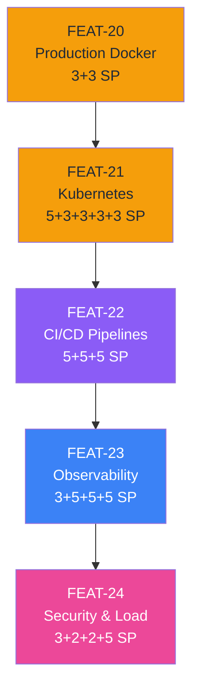
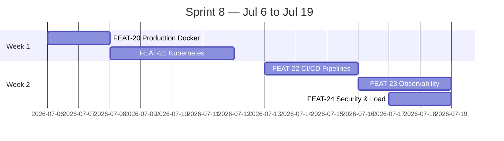
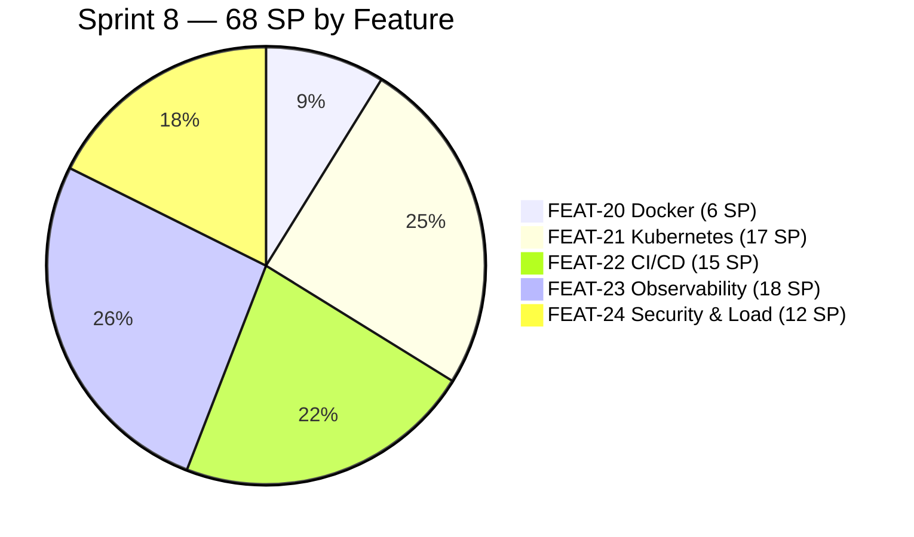

# Sprint 8 — Kickoff Checklist

> **Jul 6 - Jul 19** | **Goal**: Production-ready with CI/CD, monitoring, security, load-tested
> **Total**: 68 SP across 19 PBIs | **EPIC-6**: Production & DevOps

---

## Dependency check


> Verify all prior features are `Listo` in `CLAUDE.md` before starting S8.

---

## Execution order



---

## Blocker infrastructure checklist

| # | What | Why | Status |
|---|---|---|---|
| 1 | Kubernetes cluster (staging + prod) | F21 — all K8s PBIs require `kubectl` | ☐ |
| 2 | Container registry (ECR / GCR / Docker Hub) | F22 — GitHub Actions needs a push target | ☐ |
| 3 | Domain + TLS certificate | F21-PBI-03 — Ingress + TLS termination | ☐ |
| 4 | Grafana instance | F23-PBI-03 — dashboards | ☐ |
| 5 | Production secrets (DB, JWT, Redis, RabbitMQ) | F21-PBI-05 — K8s Secrets | ☐ |
| 6 | `GITHUB_TOKEN` with registry + K8s permissions | F22 — CI pipelines | ☐ |
| 7 | Zipkin or Jaeger instance | F23-PBI-04 — distributed tracing | ☐ (week 2) |

---

## New environment variables to document in `.env.example`

```bash
# Registry & K8s
REGISTRY_URL=registry.example.com
K8S_NAMESPACE_STAGING=staging
K8S_NAMESPACE_PROD=production
KUBECONFIG=/path/to/kubeconfig

# Observability
GRAFANA_URL=https://grafana.example.com
PROMETHEUS_ENDPOINT=http://prometheus:9090
OTEL_EXPORTER_ENDPOINT=http://jaeger:14268/api/traces

# Load testing
K6_VUS=100
K6_DURATION=5m
```

---

## K8s secrets to create manually (never commit)

```bash
kubectl create secret generic trading-saas-secrets \
  --from-literal=DB_PASSWORD=... \
  --from-literal=JWT_SECRET=... \
  --from-literal=REDIS_PASSWORD=... \
  --from-literal=RABBITMQ_PASSWORD=... \
  --namespace=staging

# Repeat for production namespace
```

---

## CLAUDE.md updates required

### Feature Status table — add EPIC-6 rows

| Feature | Jira | Status |
|---|---|---|
| FEAT-20: Production Docker & Scanning | SCRUM-? | `To Do` |
| FEAT-21: Kubernetes | SCRUM-? | `To Do` |
| FEAT-22: CI/CD Pipelines | SCRUM-? | `To Do` |
| FEAT-23: Observability | SCRUM-? | `To Do` |
| FEAT-24: Security & Load Testing | SCRUM-? | `To Do` |

### Next In Development block

```markdown
**PBI:** `E6-F20-PBI-01` - Production Docker Compose
**Feature:** FEAT-20: Production Docker & Scanning
**Epic:** EPIC-6: Production & DevOps
**Sprint:** S8
**Jira:** SCRUM-XXX -> `To Do`
```

---

## Jira sync commands

```bash
# Preview
python scripts/jira-sync.py --sprint S8 --dry-run

# Create + start sprint S8
python scripts/jira-sync.py --sprint S8 --start-sprint S8
```

---

## Sprint timeline



---

## Story point distribution



---

## Definition of Done — Sprint 8

- [ ] `kubectl get pods -n production` → all 4 services `Running`
- [ ] Grafana dashboard shows HTTP latency + error rate per service
- [ ] GitHub Actions triggers on PR, deploys to staging on merge to `main`
- [ ] Manual approval gate required before production deploy
- [ ] k6 report: p95 latency < 500ms for signals, < 2s for backtest submit
- [ ] No CRITICAL/HIGH CVEs in `trivy` scan of any image
- [ ] All security headers present (`curl -I https://prod-url`)
- [ ] Distributed traces visible in Zipkin/Jaeger for cross-service requests
