# Trading SaaS Platform - Architecture & Implementation Plan

## Context

Build a production-ready, subscription-based SaaS platform that uses AI (CNNs/deep learning) to analyze stock market data and generate actionable trading signals (buy/sell/hold). The platform must be scalable to thousands of users, secure by design, and monetizable with free/premium tiers. Starting from an empty workspace at `c:\Users\fakdu\workspace\projects\trading_saas`.

---

## Architecture Overview

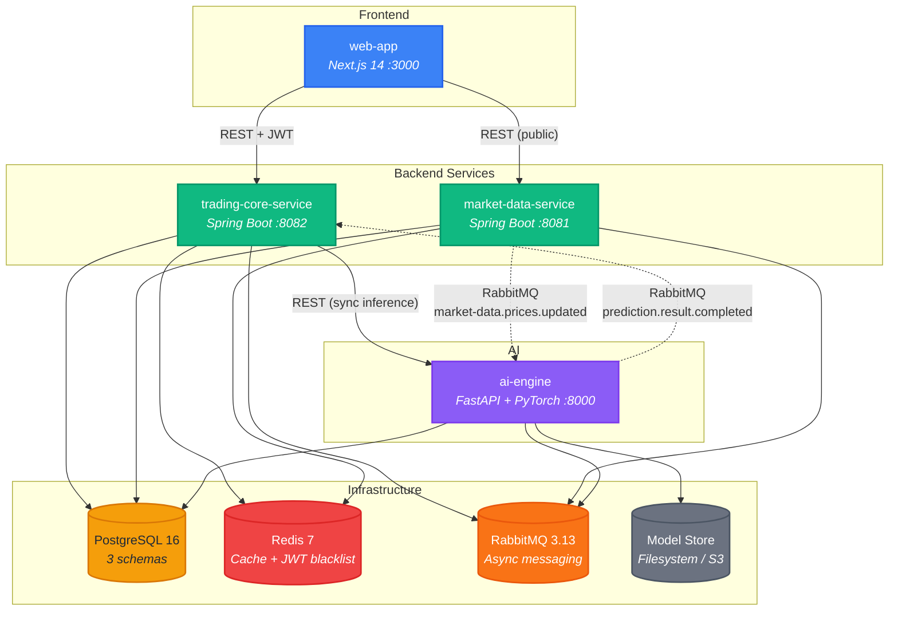

> **Legend:**
> $\color{#3b82f6}{\textsf{Blue}}$ = Frontend |
> $\color{#10b981}{\textsf{Green}}$ = Java Backend |
> $\color{#8b5cf6}{\textsf{Purple}}$ = AI / Python |
> $\color{#f59e0b}{\textsf{Amber}}$ = Database |
> $\color{#ef4444}{\textsf{Red}}$ = Cache |
> $\color{#f97316}{\textsf{Orange}}$ = Messaging

### 4 Services, Clear Boundaries

| Service | Stack | Responsibility |
|---|---|---|
| `market-data-service` | Java 21 / Spring Boot 3 | Data ingestion (Yahoo Finance), OHLCV storage, technical indicators (RSI, MACD, SMA via ta4j), historical data API |
| `trading-core-service` | Java 21 / Spring Boot 3 | Auth (JWT), subscriptions, signal generation, strategies, backtesting, portfolios, risk management |
| `ai-engine` | Python / FastAPI / PyTorch | CNN model training & inference, feature engineering, model versioning |
| `web-app` | TypeScript / Next.js 14 | Dashboard UI, charts (TradingView Lightweight Charts), auth flows, SSR landing pages |

### Key Architectural Decisions

- **Monorepo**: Single repo, path-triggered CI per service. Simpler for small teams.
- **Shared PostgreSQL, separate schemas**: `market_data`, `trading_core`, `ai_engine` - logical isolation, operational simplicity. No cross-schema joins.
- **Hybrid communication**: REST for sync inference, RabbitMQ for async batch predictions and event-driven flows.
- **RabbitMQ over Kafka**: Simpler ops for thousands (not millions) of users. Built-in DLQ/retry.
- **Clean Architecture in Java**: `domain/` (pure Java) -> `application/` (use cases) -> `adapter/` (Spring, JPA, external). Enforced by ArchUnit tests.

---

## Clean Architecture (Java Services)

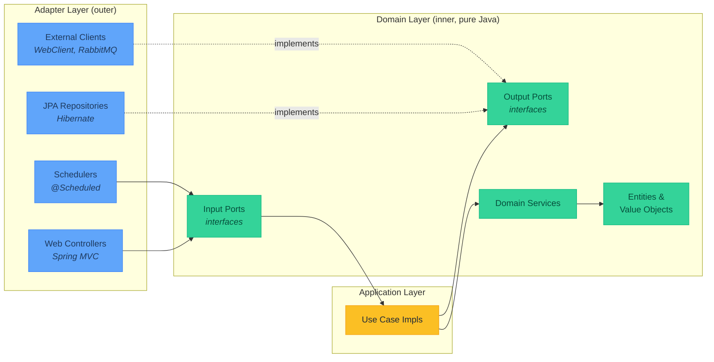

> **Legend:**
> $\color{#34d399}{\textsf{Green}}$ = Domain (pure Java, no frameworks) |
> $\color{#fbbf24}{\textsf{Yellow}}$ = Application (orchestration) |
> $\color{#60a5fa}{\textsf{Blue}}$ = Adapters (Spring, JPA, external)

---

## Monorepo Structure

```
trading_saas/
+-- README.md
+-- docker-compose.yml
+-- docker-compose.prod.yml
+-- Makefile
+-- .gitignore
+-- .env.example
+-- .github/workflows/          (CI per service, path-triggered)
+-- infrastructure/
|   +-- k8s/                    (Kubernetes manifests per service)
|   +-- init-schemas.sql        (CREATE SCHEMA for all 3 schemas)
+-- services/
|   +-- market-data-service/    (Java 21, Spring Boot 3, Maven)
|   +-- trading-core-service/   (Java 21, Spring Boot 3, Maven)
|   +-- ai-engine/              (Python 3.11, FastAPI, PyTorch)
|   +-- web-app/                (Next.js 14, TypeScript, Tailwind)
+-- shared/
|   +-- api-specs/              (OpenAPI 3.1 specs)
+-- scripts/
    +-- setup-dev.sh
    +-- seed-data.sh
```

---

## Phased Implementation Plan

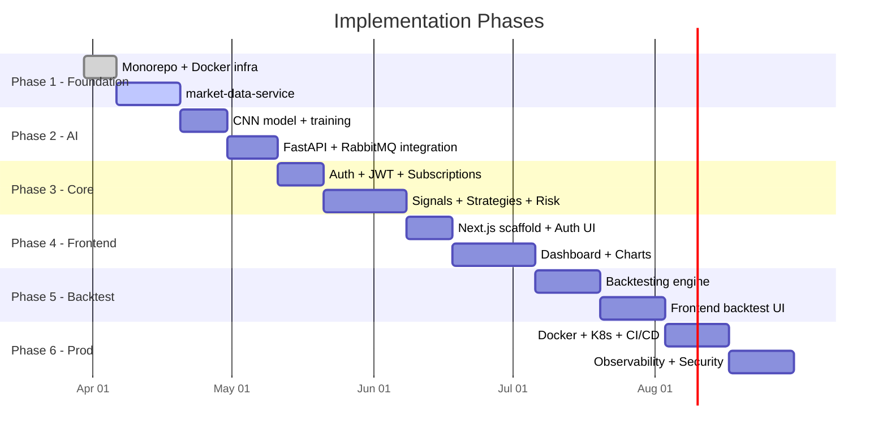

### Phase 1: Foundation - Monorepo + Data Ingestion
**Goal**: Working monorepo, infrastructure, market data service with Yahoo Finance ingestion

**Steps**:
1. Initialize git repo, create monorepo structure, `.gitignore`, `Makefile`
2. Create `docker-compose.yml` with PostgreSQL 16, Redis 7, RabbitMQ 3.13
3. Create `infrastructure/init-schemas.sql` (market_data, trading_core, ai_engine schemas)
4. Scaffold `market-data-service` (Spring Boot 3, Maven, Java 21):
   - Clean Architecture packages: `domain/`, `application/`, `adapter/`, `config/`
   - Domain models: `StockPrice`, `Symbol`, `TechnicalIndicator`, `OHLCV`, `TimeFrame`
   - Ports (interfaces): `MarketDataProvider`, `StockPriceRepository`, `MarketDataEventPublisher`
   - Use cases: `FetchMarketDataUseCase`, `GetHistoricalDataUseCase`, `CalculateIndicatorsUseCase`
   - Adapters: Yahoo Finance REST adapter, JPA repository, RabbitMQ publisher
   - Scheduled ingestion job (configurable symbols, daily cron)
   - Technical indicators via `ta4j` library (RSI, MACD, SMA-20, SMA-50)
   - REST API: `GET /api/v1/symbols`, `GET /api/v1/prices/{ticker}/history`, `GET /api/v1/indicators/{ticker}`
   - Flyway migrations: `symbols`, `stock_prices`, `technical_indicators` tables
   - Redis caching for latest prices
   - Health check via Spring Actuator
5. Unit tests (domain logic, indicator calculations) + integration test (data persistence)
6. Dockerfile (multi-stage build)

**Key files to create**:
- `services/market-data-service/pom.xml`
- `services/market-data-service/src/main/java/com/tradingsaas/marketdata/` (full Clean Arch tree)
- `services/market-data-service/src/main/resources/application.yml`
- `services/market-data-service/src/main/resources/db/migration/V1__*.sql, V2__*.sql`
- `services/market-data-service/Dockerfile`

**Libraries**: Spring Boot 3.3, Spring Data JPA, Flyway, ta4j 0.16, Spring AMQP, Spring Data Redis

---

### Phase 2: AI Engine - CNN Model + Prediction API
**Goal**: Working CNN model, FastAPI prediction endpoint, RabbitMQ integration

```mermaid
graph LR
    IN["Input<br/><b>(batch, 17, 60)</b>"]
    C1["Conv1d 17→64, k=3<br/>BatchNorm → ReLU<br/>MaxPool(2)"]
    C2["Conv1d 64→128, k=3<br/>BatchNorm → ReLU<br/>MaxPool(2)"]
    C3["Conv1d 128→256, k=3<br/>BatchNorm → ReLU<br/>AdaptiveAvgPool(1)"]
    FC1["Linear 256→128<br/>Dropout 0.5"]
    FC2["Linear 128→3"]
    OUT["Output<br/><b>DOWN | NEUTRAL | UP</b>"]

    IN --> C1 --> C2 --> C3 --> FC1 --> FC2 --> OUT

    style IN fill:#e0e7ff,stroke:#6366f1,color:#312e81,stroke-width:2px
    style C1 fill:#8b5cf6,stroke:#7c3aed,color:#ffffff,stroke-width:2px
    style C2 fill:#7c3aed,stroke:#6d28d9,color:#ffffff,stroke-width:2px
    style C3 fill:#6d28d9,stroke:#5b21b6,color:#ffffff,stroke-width:2px
    style FC1 fill:#f59e0b,stroke:#d97706,color:#1f2937,stroke-width:2px
    style FC2 fill:#f59e0b,stroke:#d97706,color:#1f2937,stroke-width:2px
    style OUT fill:#10b981,stroke:#059669,color:#ffffff,stroke-width:2px
```

> **Legend:**
> $\color{#e0e7ff}{\textsf{Indigo light}}$ = Input |
> $\color{#8b5cf6}{\textsf{Purple gradient}}$ = Conv blocks (deeper = later) |
> $\color{#f59e0b}{\textsf{Amber}}$ = Fully connected |
> $\color{#10b981}{\textsf{Green}}$ = Output

**Steps**:
1. Scaffold `ai-engine` Python service with `pyproject.toml` and `requirements.txt`
2. FastAPI application with health, readiness, and prediction endpoints
3. CNN model (PyTorch): 3-block 1D CNN as shown above
4. Feature engineering pipeline:
   - 17 features: OHLCV (5) + RSI, MACD, MACD_signal, MACD_hist, SMA_20, SMA_50, EMA_12, EMA_26, BB_upper, BB_lower, ATR, OBV (12)
   - MinMaxScaler normalization, sliding window sequence builder
5. Training pipeline: DataLoader, CrossEntropyLoss with class weights, AdamW optimizer, ReduceLROnPlateau, early stopping
6. Label generation: compare close[t+5] vs close[t] -> UP (>+1%), DOWN (<-1%), NEUTRAL
7. Model registry: version tracking, artifact storage, active model selection
8. Alembic migrations for `ai_engine` schema (model_versions, training_runs, predictions)
9. RabbitMQ consumer for batch prediction requests, publisher for results
10. REST endpoints: `POST /api/v1/predict`, `POST /api/v1/predict/batch`, `POST /api/v1/models/train`, `GET /api/v1/models`
11. Abstract `BasePredictor` interface for future LSTM/Transformer extensibility
12. Unit tests (model shape, feature engineering) + integration tests (API)
13. Dockerfile

**Key files**:
- `services/ai-engine/pyproject.toml`, `requirements.txt`
- `services/ai-engine/src/ai_engine/main.py`
- `services/ai-engine/src/ai_engine/core/models/base.py`, `cnn.py`
- `services/ai-engine/src/ai_engine/core/preprocessing/feature_engineering.py`, `normalizer.py`, `sequence_builder.py`
- `services/ai-engine/src/ai_engine/core/training/trainer.py`, `evaluator.py`
- `services/ai-engine/src/ai_engine/core/inference/predictor.py`, `model_registry.py`
- `services/ai-engine/src/ai_engine/api/routes/prediction.py`, `model.py`, `health.py`
- `services/ai-engine/src/ai_engine/messaging/consumer.py`, `publisher.py`

**Libraries**: FastAPI, PyTorch, pandas, scikit-learn, ta (technical analysis), aio-pika, SQLAlchemy, Alembic

---

### Phase 3: Trading Core - Auth, Signals, Strategies
**Goal**: User system with JWT, signal generation from AI predictions, strategy & risk management

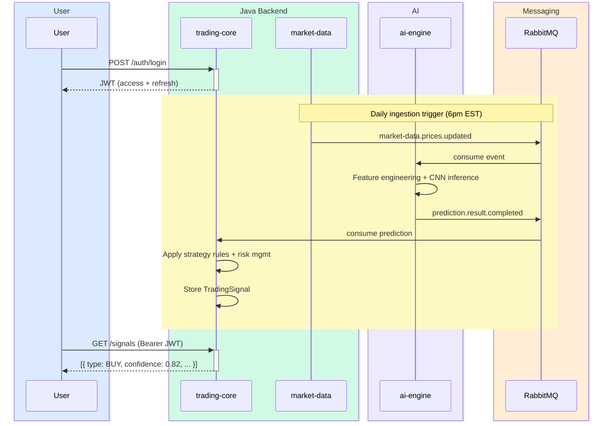

**Steps**:
1. Scaffold `trading-core-service` (Spring Boot 3, Maven):
   - DDD bounded contexts: `user/`, `signal/`, `strategy/`, `portfolio/` (package-level)
   - Clean Architecture within each context
2. User domain:
   - Entities: `User`, `Subscription` (plan: FREE/BASIC/PREMIUM)
   - Spring Security 6 + custom JWT filter (access token 15min, refresh token 7d)
   - BCrypt password hashing, refresh token rotation, Redis blacklist for logout
   - REST: `POST /auth/register`, `POST /auth/login`, `POST /auth/refresh`, `POST /auth/logout`
3. Signal domain:
   - Entity: `TradingSignal` (type: BUY/SELL/HOLD, confidence 0-1, timeframe)
   - `SignalGenerationService`: calls AI engine REST -> applies strategy rules -> stores signal
   - REST client to ai-engine with Resilience4j circuit breaker (timeout 5s, 50% failure threshold)
   - REST: `GET /signals`, `GET /signals/latest`, `GET /signals/{id}`
4. Strategy domain:
   - Entity: `Strategy` with `RiskParameters` (stop-loss %, take-profit %, max position %)
   - `RiskManager`: position sizing, stop-loss/take-profit calculation
   - CRUD REST: `POST/GET/PUT/DELETE /strategies`
5. Subscription enforcement:
   - Custom `@RequiresSubscription` annotation + AOP aspect
   - Rate limiting per tier via bucket4j + Redis (FREE: 5 signals/day, BASIC: 50, PREMIUM: unlimited)
6. RabbitMQ listener for prediction results -> auto-generate signals
7. Inter-service REST client to market-data-service for price data
8. Flyway migrations: users, subscriptions, trading_signals, strategies, portfolios, positions, backtests
9. Comprehensive tests: security tests, controller tests (MockMvc), use case tests, ArchUnit tests
10. Dockerfile

**Key files**:
- `services/trading-core-service/pom.xml`
- `services/trading-core-service/src/main/java/com/tradingsaas/tradingcore/` (DDD + Clean Arch tree)
- Flyway migrations V1-V6

**Libraries**: Spring Security 6, jjwt 0.12.5, Resilience4j, bucket4j, MapStruct

---

### Phase 4: Frontend Dashboard
**Goal**: Production-ready Next.js dashboard with auth, signals, charts

```mermaid
graph TB
    subgraph pages["Next.js App Router"]
        LAND["/ <br/><i>Landing SSR</i>"]
        PRICE["/pricing<br/><i>SSR</i>"]
        LOGIN["/auth/login"]
        REG["/auth/register"]

        subgraph dash["Dashboard (authenticated)"]
            DASH["/dashboard<br/><i>Overview</i>"]
            SIG["/dashboard/signals<br/><i>Signal table + charts</i>"]
            PORT["/dashboard/portfolio<br/><i>Positions, P&L</i>"]
            BT["/dashboard/backtest<br/><i>Config + results</i>"]
            SETT["/dashboard/settings<br/><i>Profile, subscription</i>"]
        end
    end

    subgraph libs["Client Libraries"]
        TQ["TanStack Query<br/><i>Server state</i>"]
        ZU["Zustand<br/><i>Client state</i>"]
        LWC["Lightweight Charts<br/><i>TradingView</i>"]
        SHAD["shadcn/ui<br/><i>Components</i>"]
    end

    DASH --> TQ
    SIG --> LWC
    SIG --> TQ
    PORT --> TQ
    BT --> TQ

    style LAND fill:#dbeafe,stroke:#3b82f6,color:#1e3a5f,stroke-width:2px
    style PRICE fill:#dbeafe,stroke:#3b82f6,color:#1e3a5f,stroke-width:2px
    style LOGIN fill:#fef3c7,stroke:#f59e0b,color:#78350f,stroke-width:2px
    style REG fill:#fef3c7,stroke:#f59e0b,color:#78350f,stroke-width:2px
    style DASH fill:#d1fae5,stroke:#10b981,color:#064e3b,stroke-width:2px
    style SIG fill:#d1fae5,stroke:#10b981,color:#064e3b,stroke-width:2px
    style PORT fill:#d1fae5,stroke:#10b981,color:#064e3b,stroke-width:2px
    style BT fill:#d1fae5,stroke:#10b981,color:#064e3b,stroke-width:2px
    style SETT fill:#d1fae5,stroke:#10b981,color:#064e3b,stroke-width:2px
    style TQ fill:#ede9fe,stroke:#8b5cf6,color:#4c1d95,stroke-width:2px
    style ZU fill:#ede9fe,stroke:#8b5cf6,color:#4c1d95,stroke-width:2px
    style LWC fill:#ede9fe,stroke:#8b5cf6,color:#4c1d95,stroke-width:2px
    style SHAD fill:#ede9fe,stroke:#8b5cf6,color:#4c1d95,stroke-width:2px
```

> **Legend:**
> $\color{#3b82f6}{\textsf{Blue}}$ = Public SSR pages |
> $\color{#f59e0b}{\textsf{Amber}}$ = Auth pages |
> $\color{#10b981}{\textsf{Green}}$ = Protected dashboard |
> $\color{#8b5cf6}{\textsf{Purple}}$ = Client libraries

**Steps**:
1. Scaffold `web-app` with Next.js 14 App Router, TypeScript, Tailwind CSS
2. Install shadcn/ui components, TradingView Lightweight Charts, TanStack Query, Zustand
3. SSR pages: Landing (`/`), Pricing (`/pricing`)
4. Auth pages: Login, Register (NextAuth.js with credentials provider -> trading-core JWT)
5. Dashboard layout: Sidebar nav, Header with user menu
6. Dashboard pages:
   - Overview: portfolio summary cards, top signals, recent activity
   - Signals (`/dashboard/signals`): filterable/sortable table, signal detail with candlestick chart
   - Portfolio (`/dashboard/portfolio`): positions, P&L, allocation donut chart
   - Backtest (`/dashboard/backtest`): config form, results with equity curve
   - Settings (`/dashboard/settings`): profile, subscription management
7. Charts: CandlestickChart with indicator overlays, PerformanceChart, DrawdownChart
8. API client layer with TanStack Query for caching
9. WebSocket/SSE for real-time signal updates (premium tier)
10. Responsive + dark mode
11. Dockerfile

**Key files**:
- `services/web-app/package.json`, `next.config.js`, `tailwind.config.ts`
- `services/web-app/src/app/` (all page routes)
- `services/web-app/src/components/` (UI, charts, signals, portfolio, layout)
- `services/web-app/src/lib/api-client.ts`, `auth.ts`
- `services/web-app/src/hooks/useSignals.ts`, `usePortfolio.ts`

**Libraries**: Next.js 14, shadcn/ui, TanStack Query v5, Zustand, Lightweight Charts, NextAuth.js

---

### Phase 5: Backtesting Engine + Advanced Features
**Goal**: Event-driven backtesting, performance analytics, portfolio tracking

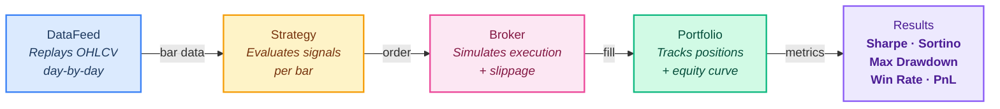

**Steps**:
1. Backtesting engine in `trading-core-service`:
   - Event-driven architecture: DataFeed -> Strategy -> Broker (simulated) -> Portfolio tracker
   - Slippage modeling, commission handling
   - Metrics: total return, annualized return, Sharpe ratio, Sortino ratio, max drawdown, Calmar ratio, win rate, profit factor
   - S&P 500 benchmark comparison
   - Async execution: submit backtest -> poll status -> fetch results
   - REST: `POST /backtests`, `GET /backtests`, `GET /backtests/{id}`, `GET /backtests/{id}/trades`
2. Portfolio tracking:
   - Position management (open/close)
   - P&L calculation (realized + unrealized)
   - Portfolio snapshots over time
3. Frontend additions:
   - Backtest configuration form (symbol, date range, strategy, initial capital)
   - Results: equity curve chart, drawdown chart, trade markers on price chart, metrics table
   - Strategy vs benchmark comparison view
4. Performance optimizations: Redis caching for hot data, DB query tuning, gzip compression

---

### Phase 6: Production Hardening + Deployment
**Goal**: Docker, K8s manifests, CI/CD, observability, security hardening

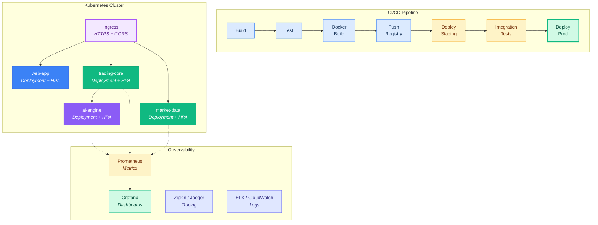

**Steps**:
1. Multi-stage Dockerfiles for all services
2. `docker-compose.prod.yml` with resource limits, restart policies
3. Kubernetes manifests: Deployments, Services, Ingress, HPA, ConfigMaps, Secrets, NetworkPolicies
4. GitHub Actions CI/CD: build -> test -> Docker build -> push -> deploy staging -> integration tests -> deploy prod
5. Observability:
   - Structured JSON logging (logback for Java, structlog for Python)
   - Micrometer + Prometheus metrics + Grafana dashboards
   - Distributed tracing (Micrometer Tracing + Zipkin/Jaeger)
   - Liveness/readiness probes
6. Security hardening:
   - OWASP dependency check in CI
   - CSP headers, CORS config, HTTPS at ingress
   - Input validation (Bean Validation), SQL injection protection (JPA parameterized queries)
   - Secrets management (K8s Secrets / Vault)
   - Rate limiting at API gateway level
7. Load testing: k6 scripts for login, signals, backtest flows

---

## Database Schema Summary

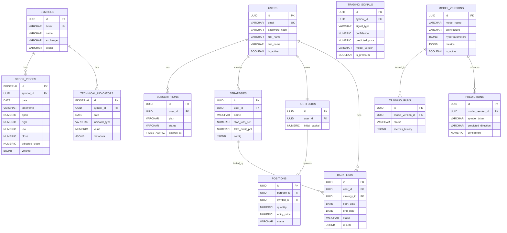

---

## Subscription Tiers

| Feature | FREE | BASIC | PREMIUM |
|---|---|---|---|
| Signals/day | 5 | 50 | Unlimited |
| Symbols tracked | 5 | 25 | Unlimited |
| Backtests/day | 1 | 10 | Unlimited |
| Historical data | 1 year | 5 years | Full |
| Real-time updates | No | 5min delay | Real-time |

---

## Messaging (RabbitMQ)

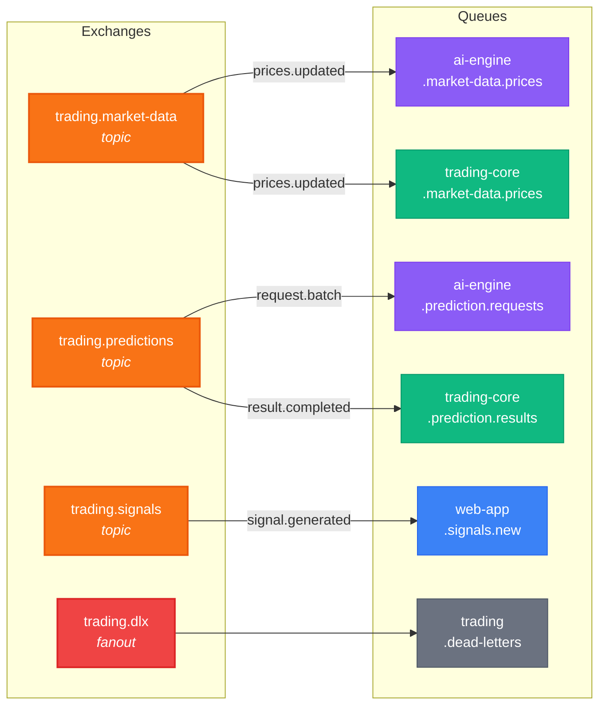

> **Legend:**
> $\color{#f97316}{\textsf{Orange}}$ = Exchanges |
> $\color{#8b5cf6}{\textsf{Purple}}$ = AI engine queues |
> $\color{#10b981}{\textsf{Green}}$ = Trading core queues |
> $\color{#3b82f6}{\textsf{Blue}}$ = Web app queues |
> $\color{#ef4444}{\textsf{Red}}$ = Dead letter

---

## Data Pipeline (End-to-End)

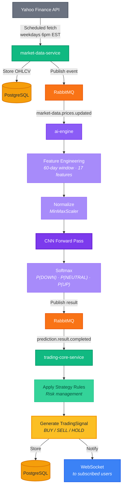

---

## Verification Plan

After each phase, verify:

1. **Phase 1**: `docker-compose up` -> PostgreSQL/Redis/RabbitMQ start -> `market-data-service` starts -> `curl GET /actuator/health` returns UP -> trigger ingestion -> verify OHLCV data in DB -> `GET /api/v1/prices/AAPL/history` returns data
2. **Phase 2**: `ai-engine` starts -> `GET /health` -> train model via `POST /api/v1/models/train` -> `POST /api/v1/predict` returns prediction with direction + confidence
3. **Phase 3**: Register user -> login (get JWT) -> create strategy -> `GET /signals` returns signals -> verify rate limiting for FREE tier
4. **Phase 4**: `web-app` at localhost:3000 -> landing page renders -> login flow works -> dashboard shows signals + charts
5. **Phase 5**: Create backtest via UI -> poll until completed -> view equity curve, metrics, trade list -> compare vs benchmark
6. **Phase 6**: `docker-compose -f docker-compose.prod.yml up` -> all services healthy -> k8s manifests apply cleanly -> CI pipeline passes

Run tests per service:
- Java: `mvn test` (unit) + `mvn verify` (integration with Testcontainers)
- Python: `pytest tests/unit` + `pytest tests/integration`
- Frontend: `npm test` + `npx playwright test`
